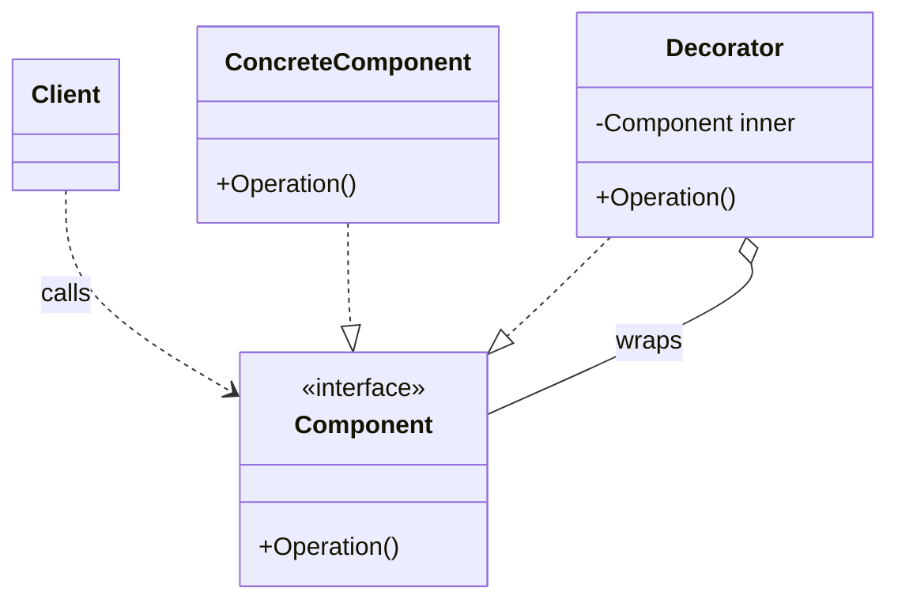
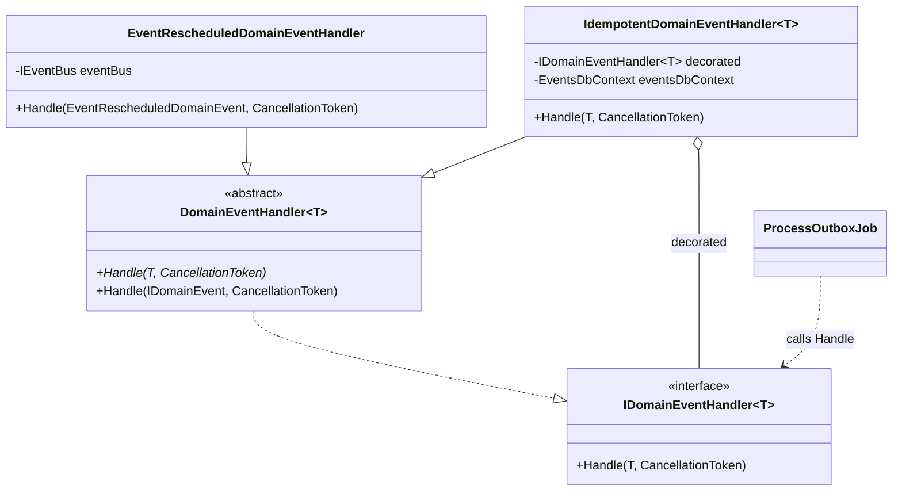
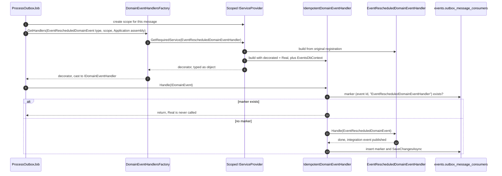

# Decorator pattern: idempotent event handlers

[Overview](README.md)

Every domain-event handler and integration-event handler in Evently runs inside a wrapper that makes it **idempotent**: if the outbox or inbox job retries a message, handlers that already succeeded are skipped. The handlers don't contain that logic. It is added from outside with the **decorator pattern**, and [Scrutor](https://github.com/khellang/Scrutor)'s `Decorate` wires it into the DI container.

This page explains the pattern in general, then how Evently uses it, using the Events module as the example. The other three modules do the same thing.

## The pattern

A **decorator** is an object that:

1. implements **the same interface** as the object it wraps,
2. holds a reference to the wrapped object, typed as that interface,
3. forwards calls to it, adding behavior before, after, or instead of the call.

The caller depends only on the interface, so it cannot tell whether it has the real object or a wrapped one. Behavior is added by **composing objects**, not by changing the class or inheriting from it.



| Role | Responsibility |
| --- | --- |
| **Component** | The interface the client depends on |
| **Concrete component** | Does the real work |
| **Decorator** | Implements Component, holds a Component, adds one behavior |
| **Client** | Calls through the interface and doesn't know what's behind it |

Around the inner call, a decorator can:

- run code **before** it (check, log, start a timer),
- run code **after** it (record, log, commit),
- **skip** it entirely (short-circuit),
- change the arguments or the result, or catch exceptions.

### A familiar example from .NET

Streams are the classic decorator in the base class library:

```csharp
Stream stream = new GZipStream(
    new BufferedStream(
        new FileStream(path, FileMode.Create)),
    CompressionMode.Compress);
```

Each class **is** a `Stream` and **wraps** a `Stream`. `FileStream` does the real I/O; `BufferedStream` adds buffering; `GZipStream` adds compression. Code that writes to `stream` only sees `Stream`.

## The roles in Evently

| Role | Evently type |
| --- | --- |
| Component | [`IDomainEventHandler<T>`](../../src/Shared/Evently.Shared.Application/Messaging/IDomainEventHandler.cs), plus its non-generic parent `IDomainEventHandler` |
| Concrete component | Each Application handler, e.g. [`EventRescheduledDomainEventHandler`](../../src/Modules/Events/Evently.Modules.Events.Application/Events/DomainEventHandlers/EventRescheduledDomainEventHandler.cs) |
| Decorator | [`IdempotentDomainEventHandler<T>`](../../src/Modules/Events/Evently.Modules.Events.Infrastructure/Outbox/IdempotentDomainEventHandler.cs) |
| Client | [`ProcessOutboxJob`](../../src/Modules/Events/Evently.Modules.Events.Infrastructure/Outbox/ProcessOutboxJob.cs), via [`DomainEventHandlersFactory`](../../src/Shared/Evently.Shared.Infrastructure/Outbox/DomainEventHandlersFactory.cs) |



The real handler only does business work. `EventRescheduledDomainEventHandler` publishes an integration event and knows nothing about retries:

```csharp
internal sealed class EventRescheduledDomainEventHandler(IEventBus eventBus)
    : DomainEventHandler<EventRescheduledDomainEvent>
{
    public async override Task Handle(EventRescheduledDomainEvent domainEvent, CancellationToken cancellationToken = default)
    {
        await eventBus.PublishAsync(new EventRescheduledIntegrationEvent(...), cancellationToken);
    }
}
```

The decorator shows all three decorator traits: same interface, a wrapped instance typed as the interface, and behavior around the call:

```csharp
internal sealed class IdempotentDomainEventHandler<TDomainEvent>(
    IDomainEventHandler<TDomainEvent> decorated,   // the wrapped handler, typed as the interface
    EventsDbContext eventsDbContext)               // extra dependency only the decorator needs
    : DomainEventHandler<TDomainEvent>             // is itself a handler, so the client can't tell
    where TDomainEvent : IDomainEvent
{
    public override async Task Handle(TDomainEvent domainEvent, CancellationToken cancellationToken = default)
    {
        var outboxMessageConsumer = new OutboxMessageConsumer(domainEvent.Id, decorated.GetType().Name);

        if (await OutboxConsumerExistsAsync(outboxMessageConsumer, cancellationToken))
        {
            return;                                           // skip: already handled
        }

        await decorated.Handle(domainEvent, cancellationToken); // forward to the real handler

        await InsertOutboxConsumerAsync(outboxMessageConsumer, cancellationToken); // after: record success
    }
    ...
}
```

The marker it reads and writes is a row in `outbox_message_consumers`, keyed by `(OutboxMessageId, Name)`: the domain event id plus the **wrapped handler's class name**. One event with three handlers gets three independent markers, so a retry skips the handlers that finished and reruns only the one that failed.

### The same thing written by hand

Without DI, wrapping a handler looks like this:

```csharp
IDomainEventHandler<EventRescheduledDomainEvent> real =
    new EventRescheduledDomainEventHandler(eventBus);

IDomainEventHandler<EventRescheduledDomainEvent> handler =
    new IdempotentDomainEventHandler<EventRescheduledDomainEvent>(real, eventsDbContext);

await handler.Handle(domainEvent); // the caller sees an IDomainEventHandler, nothing else
```

Evently never writes this. The container builds the same object graph through Scrutor.

## Wiring it with Scrutor

[`EventsModule.AddDomainEventHandlers`](../../src/Modules/Events/Evently.Modules.Events.Infrastructure/EventsModule.cs) registers and decorates every handler in the module's Application assembly:

```csharp
private static void AddDomainEventHandlers(this IServiceCollection services)
{
    Type[] domainEventHandlers = Application.AssemblyReference.Assembly
        .GetTypes()
        .Where(t => t.IsAssignableTo(typeof(IDomainEventHandler)))
        .ToArray();

    foreach (Type domainEventHandler in domainEventHandlers)
    {
        services.TryAddScoped(domainEventHandler);

        Type domainEvent = domainEventHandler
            .GetInterfaces()
            .Single(i => i.IsGenericType)
            .GetGenericArguments()
            .Single();

        Type closedIdempotentHandler = typeof(IdempotentDomainEventHandler<>).MakeGenericType(domainEvent);

        services.Decorate(domainEventHandler, closedIdempotentHandler);
    }
}
```

Step by step, for `EventRescheduledDomainEventHandler`:

1. **Scan.** Every type in `Evently.Modules.Events.Application` that implements the non-generic `IDomainEventHandler` is a handler. The decorator lives in **Infrastructure**, so the scan never picks it up as a handler.
2. **Register the real handler.** `TryAddScoped(domainEventHandler)` registers it **under its own concrete type**: service type and implementation type are both `EventRescheduledDomainEventHandler`. This must happen first, because `Decorate` throws `Scrutor.DecorationException` when no registration exists for the service type.
3. **Find the event type.** The handler's only generic interface is `IDomainEventHandler<EventRescheduledDomainEvent>`, and its single type argument is the event. `.Single(...)` assumes one handler handles exactly one event type. A handler implementing two `IDomainEventHandler<>` interfaces would make this throw at startup.
4. **Close the decorator.** `MakeGenericType` turns the open `IdempotentDomainEventHandler<>` into `IdempotentDomainEventHandler<EventRescheduledDomainEvent>`. A decorator type must be closed here because the service being decorated is not generic.
5. **Decorate.** `Decorate(serviceType, decoratorType)` replaces the registration for `EventRescheduledDomainEventHandler`, as shown below.

### What `Decorate` changes in the container

```
After TryAddScoped:
  resolve EventRescheduledDomainEventHandler
    → new EventRescheduledDomainEventHandler(eventBus)

After Decorate:
  resolve EventRescheduledDomainEventHandler
    → new IdempotentDomainEventHandler<EventRescheduledDomainEvent>(
          decorated:       <instance built from the original registration>,
          eventsDbContext: <resolved from the same scope>)
```

Scrutor keeps the original registration (so it can still build the inner instance) and replaces the public one with a factory. When the service is resolved, the factory:

1. builds the original handler from the original registration,
2. builds the decorator with `ActivatorUtilities`, passing the original instance as an explicit argument. It fills the `IDomainEventHandler<TDomainEvent> decorated` parameter because the instance is assignable to it. Every other constructor parameter (`EventsDbContext`) comes from the container,
3. returns the decorator.

The decorator keeps the **lifetime of the registration it decorates**, scoped here. Because `ProcessOutboxJob` creates a new DI scope per outbox message, each message gets a fresh handler, decorator, and `EventsDbContext`.

### The resolved type doesn't match the service type

The service type is the **concrete** `EventRescheduledDomainEventHandler`, but the container returns an `IdempotentDomainEventHandler<EventRescheduledDomainEvent>`, which is **not** a subclass of it. The Microsoft DI container doesn't check what a factory returns, so this works. It has one consequence for callers:

- Never cast a resolved handler to its concrete type. It would throw `InvalidCastException`.
- Cast to the shared interface instead. [`DomainEventHandlersFactory`](../../src/Shared/Evently.Shared.Infrastructure/Outbox/DomainEventHandlersFactory.cs) does exactly that:

```csharp
// Handlers are registered by concrete type, so this may return the idempotent decorator instead.
object domainEventHandler = serviceProvider.GetRequiredService(domainEventHandlerType);

// Non-generic interface lets the caller invoke Handle(IDomainEvent) without knowing T.
handlers.Add((domainEventHandler as IDomainEventHandler)!);
```

`ProcessOutboxJob` then calls the non-generic `Handle(IDomainEvent)`. The [`DomainEventHandler<T>`](../../src/Shared/Evently.Shared.Application/Messaging/DomainEventHandler.cs) base class casts the event to `T` and calls the generic `Handle(T)`, which the decorator overrides. The decorator then calls `decorated.Handle(T)` directly.

### Why a loop, not one open-generic `Decorate` call

Scrutor can decorate every closed version of an open generic service in one call:

```csharp
services.Decorate(typeof(IDomainEventHandler<>), typeof(IdempotentDomainEventHandler<>));
```

That only matches registrations whose **service type** is `IDomainEventHandler<T>`. Evently registers handlers by **concrete type**, because `DomainEventHandlersFactory` finds handler types by scanning the assembly and resolves them by concrete type. None of those concrete types is generic, so the one-liner would match nothing, and `Decorate` would throw `DecorationException` because no registration matched. Each handler has to be decorated individually. See [possible refactor 01](../../possible-refactors/01-shared-idempotent-domain-event-handler.md#scrutor-open-generic-decoration).

## Runtime: one outbox message



For the surrounding transaction and retry behavior, see [Domain events and outbox](../events/01-domain-events-and-outbox.md) and [Database reads, writes, and retries](../events/04-database-reads-writes-and-retries.md).

## Why a decorator

| Option | Problem |
| --- | --- |
| Put the check inside every handler | The same select-and-insert is copied into every handler. A new handler that forgets it silently loses idempotency. |
| Base class, e.g. `IdempotentDomainEventHandlerBase<T>` | **Layering.** Handlers live in **Application**, but idempotency needs `EventsDbContext` and the `outbox_message_consumers` table, which live in **Infrastructure**. A base class would pull infrastructure into Application. **Single inheritance.** Handlers already use their one base class for `DomainEventHandler<T>`. **Opt-in.** Each handler has to remember to inherit from it. |
| MediatR pipeline behavior | Domain events are not dispatched through MediatR. `ProcessOutboxJob` calls handlers directly, so a pipeline behavior would never run. |
| **Decorator (chosen)** | Handlers stay pure business logic. The concern is written once in Infrastructure and applied to every handler in one place, and no handler can opt out by accident. |

The decorator also respects the dependency direction: Infrastructure wraps Application from the outside, and Application never learns that the marker table exists.

## Related: MediatR pipeline behaviors

Commands and queries use the same idea through a different mechanism. [`ApplicationConfiguration`](../../src/Shared/Evently.Shared.Application/ApplicationConfiguration.cs) registers three MediatR pipeline behaviors:

```csharp
config.AddOpenBehavior(typeof(ExceptionHandlingPipelineBehaviour<,>));
config.AddOpenBehavior(typeof(RequestLoggingPipelineBehaviour<,>));
config.AddOpenBehavior(typeof(ValidationPipelineBehaviour<,>));
```

Each behavior receives a `next` delegate instead of a wrapped instance, but the shape is the same: work before, call inward, work after. The difference is **ordering**:

| Mechanism | Which registration ends up outermost |
| --- | --- |
| MediatR `AddOpenBehavior` | The **first** one registered (exception handling wraps logging, which wraps validation, which wraps the handler) |
| Scrutor `Decorate` | The **last** one registered. Each call wraps whatever is currently registered. |

ASP.NET Core middleware is another variant of the same "chain of wrappers around a core action" idea.

## Pitfalls

### Stacking another decorator inside the idempotent one breaks the key

Decorators can nest, e.g. `Logging(Idempotent(Real))`. With Scrutor, **the last `Decorate` call is the outermost wrapper**.

The idempotency key uses the name of **whatever the idempotent decorator wraps directly**:

```csharp
new OutboxMessageConsumer(domainEvent.Id, decorated.GetType().Name);
```

If another decorator were registered *before* the idempotent one, it would end up *inside* it, and `decorated.GetType().Name` would become that decorator's name, e.g. ``LoggingDomainEventHandler`1``. That name is the same for every handler:

1. The first handler to process an event inserts the marker ``(eventId, "LoggingDomainEventHandler`1")``.
2. Every other handler for the same event finds that marker and is skipped.
3. Nothing throws. Handlers simply stop running.

**Rule:** the idempotent decorator must wrap the real handler directly. Call `Decorate` with it first; add other decorators after.

### The handler's work and the marker are not atomic

The decorator runs the handler, then saves the marker in a **separate** `SaveChangesAsync`. If the process crashes, or the marker save fails, after the handler succeeded, the retry runs the handler again. Delivery is **at-least-once**. Handlers with external side effects, like publishing to the bus, can still run twice. See [Status and idempotency](../events/03-operations-and-failure-modes.md#status-and-idempotency) and [Failure outcomes](../events/04-database-reads-writes-and-retries.md#failure-outcomes-which-rows-remain).

### Renaming a handler class resets its markers

The key uses the class **name**. After a rename, old markers no longer match, so any message retried afterwards runs the renamed handler again.

### Resolving by concrete type returns the decorator

Already covered above: always go through `IDomainEventHandler` / `IIntegrationEventHandler`, never the concrete handler type.

### `Decorate` needs an existing registration

`TryAddScoped` must come before `Decorate`. Reversing them throws `DecorationException` at startup.

## Integration events use the same pattern

`AddIntegrationEventHandlers` repeats the loop for integration-event handlers:

| | Domain events | Integration events |
| --- | --- | --- |
| Handlers scanned from | Module **Application** assembly | Module **Presentation** assembly |
| Component | `IDomainEventHandler<T>` | [`IIntegrationEventHandler<T>`](../../src/Shared/Evently.Shared.Application/EventBus/IIntegrationEventHandler.cs) |
| Decorator | `IdempotentDomainEventHandler<T>` | [`IdempotentIntegrationEventHandler<T>`](../../src/Modules/Events/Evently.Modules.Events.Infrastructure/Inbox/IdempotentIntegrationEventHandler.cs) |
| Marker table | `outbox_message_consumers` | `inbox_message_consumers` |
| Client | `ProcessOutboxJob` + `DomainEventHandlersFactory` | `ProcessInboxJob` + [`IntegrationEventHandlersFactory`](../../src/Shared/Evently.Shared.Infrastructure/Inbox/IntegrationEventsHandlersFactory.cs) |

Everything on this page, including the pitfalls, applies to both.

## Where the code lives

Each module has its own copy of the decorators and the registration loop, because each decorator depends on its module's `DbContext`.

| Module | Registration | Domain-event decorator | Integration-event decorator |
| --- | --- | --- | --- |
| Events | [`EventsModule.cs`](../../src/Modules/Events/Evently.Modules.Events.Infrastructure/EventsModule.cs) | [`Outbox/IdempotentDomainEventHandler.cs`](../../src/Modules/Events/Evently.Modules.Events.Infrastructure/Outbox/IdempotentDomainEventHandler.cs) | [`Inbox/IdempotentIntegrationEventHandler.cs`](../../src/Modules/Events/Evently.Modules.Events.Infrastructure/Inbox/IdempotentIntegrationEventHandler.cs) |
| Users | [`UsersModule.cs`](../../src/Modules/Users/Evently.Modules.Users.Infrastructure/UsersModule.cs) | [`Outbox/IdempotentDomainEventHandler.cs`](../../src/Modules/Users/Evently.Modules.Users.Infrastructure/Outbox/IdempotentDomainEventHandler.cs) | [`Inbox/IdempotentIntegrationEventHandler.cs`](../../src/Modules/Users/Evently.Modules.Users.Infrastructure/Inbox/IdempotentIntegrationEventHandler.cs) |
| Ticketing | [`TicketingModule.cs`](../../src/Modules/Ticketing/Evently.Modules.Ticketing.Infrastructure/TicketingModule.cs) | [`Outbox/IdempotentDomainEventHandler.cs`](../../src/Modules/Ticketing/Evently.Modules.Ticketing.Infrastructure/Outbox/IdempotentDomainEventHandler.cs) | [`Inbox/IdempotentIntegrationEventHandler.cs`](../../src/Modules/Ticketing/Evently.Modules.Ticketing.Infrastructure/Inbox/IdempotentIntegrationEventHandler.cs) |
| Attendance | [`AttendanceModule.cs`](../../src/Modules/Attendance/Evently.Modules.Attendance.Infrastructure/AttendanceModule.cs) | [`Outbox/IdempotentDomainEventHandler.cs`](../../src/Modules/Attendance/Evently.Modules.Attendance.Infrastructure/Outbox/IdempotentDomainEventHandler.cs) | [`Inbox/IdempotentIntegrationEventHandler.cs`](../../src/Modules/Attendance/Evently.Modules.Attendance.Infrastructure/Inbox/IdempotentIntegrationEventHandler.cs) |

[Possible refactor 01](../../possible-refactors/01-shared-idempotent-domain-event-handler.md) proposes moving the domain-event decorator and loop into Shared as `IdempotentDomainEventHandler<TDomainEvent, TDbContext>`.
