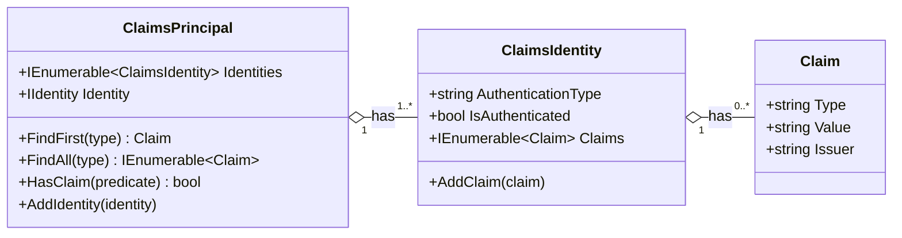
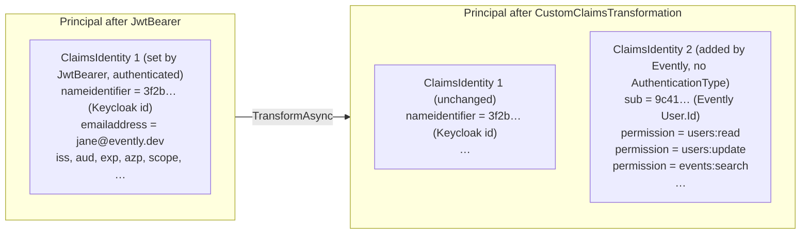

# 01 – Claims

[← Back to index](README.md)

## What a claim is

A **claim** is one statement about the caller, made by someone the application trusts. It is a `(type, value)` pair plus the issuer that made the statement:

| Type | Value | Issuer |
| --- | --- | --- |
| `email` | `jane@evently.dev` | Keycloak |
| `sub` | `3f2b…` | Keycloak |
| `permission` | `users:read` | Evently (added at runtime) |

.NET models claims with three classes from `System.Security.Claims`:



- **`Claim`**: one fact.
- **`ClaimsIdentity`**: a set of claims coming from one source, like an ID card. It counts as *authenticated* only when it has an `AuthenticationType` (the JWT bearer handler sets one).
- **`ClaimsPrincipal`**: the caller. It can hold **several** identities. `FindFirst`, `FindAll` and `HasClaim` search **all** of them. Evently relies on this: it adds a second identity to the principal instead of changing the first one.

In a minimal API endpoint, ASP.NET Core injects the current principal (`HttpContext.User`) when you declare a `ClaimsPrincipal` parameter. [`GetUserProfile`](../../src/Modules/Users/Evently.Modules.Users.Presentation/Users/GetUserProfile.cs) does exactly that:

```csharp
app.MapGet("users/profile", async (ClaimsPrincipal claims, ISender sender) => ...)
```

## Claims that come from Keycloak

Keycloak issues a JWT access token. Once decoded, the payload looks roughly like this (values shortened):

```json
{
  "exp": 1790000300,
  "iat": 1790000000,
  "iss": "http://localhost:18080/realms/Evently",
  "aud": "account",
  "sub": "3f2b8a5e-7c1d-4b9e-9a61-0d2f5c8e1a77",
  "typ": "Bearer",
  "azp": "evently-public-client",
  "scope": "openid profile email",
  "email_verified": true,
  "preferred_username": "jane@evently.dev",
  "given_name": "Jane",
  "family_name": "Doe",
  "email": "jane@evently.dev",
  "realm_access": { "roles": ["default-roles-evently", "offline_access", "uma_authorization"] }
}
```

The claims that matter to Evently:

| JWT claim | Used for |
| --- | --- |
| `iss` | Checked against `ValidIssuers` (see [02](02-authentication-keycloak.md#configuration)) |
| `aud` | Checked against `Audience` (`account`) |
| `exp`, `iat` | Token lifetime validation |
| `sub` | **Keycloak user id**, i.e. the Evently *identity id* |

> Evently does **not** use Keycloak roles (`realm_access`, `resource_access`). Roles and permissions come from Evently's own database. See [03](03-authorization-permissions.md).

### Inbound claim mapping: `sub` becomes `NameIdentifier`

By default, the JWT bearer handler (`JwtBearerOptions.MapInboundClaims = true`) renames some standard JWT claims to the long `ClaimTypes.*` URIs that older .NET code expects:

| JWT claim | Claim type inside `ClaimsPrincipal` |
| --- | --- |
| `sub` | `ClaimTypes.NameIdentifier` → `http://schemas.xmlsoap.org/ws/2005/05/identity/claims/nameidentifier` |
| `email` | `ClaimTypes.Email` |
| `given_name` | `ClaimTypes.GivenName` |
| `family_name` | `ClaimTypes.Surname` |

This is why [`ClaimsPrincipalExtensions.GetIdentityId()`](../../src/Shared/Evently.Shared.Infrastructure/Authentication/ClaimsPrincipalExtensions.cs) reads `ClaimTypes.NameIdentifier` and not `sub`:

```csharp
public static string GetIdentityId(this ClaimsPrincipal? principal)
{
    return principal?.FindFirst(ClaimTypes.NameIdentifier)?.Value
        ?? throw new EventlyException("User identity is unavailable");
}
```

It also means that after authentication **there is no claim of type `sub` on the principal**. Evently uses that free name for its own purpose (next section).

## Claims that Evently adds

[`CustomClaims`](../../src/Shared/Evently.Shared.Infrastructure/Authentication/CustomClaims.cs) defines two claim types:

```csharp
public static class CustomClaims
{
    public const string Sub = "sub";               // Evently User.Id (Guid)
    public const string Permission = "permission"; // one claim per permission code
}
```

[`CustomClaimsTransformation`](../../src/Shared/Evently.Shared.Infrastructure/Authorization/CustomClaimsTransformation.cs) adds them once per request, in a **second** `ClaimsIdentity`:



Notes:

- The added identity has no `AuthenticationType`, so on its own it is not "authenticated". That is fine: `principal.Identity` still returns identity 1 (the JWT one), so `IsAuthenticated` stays `true`.
- The same claim type (`permission`) appears many times, once per permission. `FindAll(CustomClaims.Permission)` returns them all.

## Reading claims: `ClaimsPrincipalExtensions`

Application code never parses claim types by hand. It uses [`ClaimsPrincipalExtensions`](../../src/Shared/Evently.Shared.Infrastructure/Authentication/ClaimsPrincipalExtensions.cs):

| Method | Reads claim | Returns | Throws `EventlyException` when |
| --- | --- | --- | --- |
| `GetIdentityId()` | `ClaimTypes.NameIdentifier` | Keycloak user id (`string`) | the claim is missing |
| `GetUserId()` | `sub` (added by Evently) | Evently `User.Id` (`Guid`) | the claim is missing or is not a `Guid` |
| `GetPermissions()` | `permission` (all of them) | `HashSet<string>` | the principal is `null` |

`GetIdentityId()` is used **before** the transformation (to know who to look up). `GetUserId()` and `GetPermissions()` are used **after** it (in endpoints and in the authorization handler).

## Why reuse the name `sub`?

In the JWT spec `sub` means "the subject this token is about". Inside Evently the subject of interest is the Evently user, so the transformation stores `User.Id` under `sub`. This also serves as the "already transformed" flag:

```csharp
if (principal.HasClaim(c => c.Type == CustomClaims.Sub))
{
    return principal; // already enriched, don't hit the database again
}
```

Microsoft's guidance for `IClaimsTransformation` is that `TransformAsync` may run more than once for the same principal, so it must be idempotent. Without the guard a second run would add a duplicate identity and query the database again.

> **Caveat.** This works only because `MapInboundClaims` is `true`, so Keycloak's own `sub` has already been renamed to `NameIdentifier`. If someone sets `MapInboundClaims = false` (a common tweak), Keycloak's `sub` stays as `sub`. The guard then skips the transformation, no `permission` claims are added, and `GetUserId()` returns the **Keycloak id** instead of the Evently id. Keycloak ids are also UUIDs, so this fails quietly rather than throwing. If you change claim mapping, rename `CustomClaims.Sub` to something unambiguous at the same time.

Next: [02 – Authentication with Keycloak →](02-authentication-keycloak.md)
