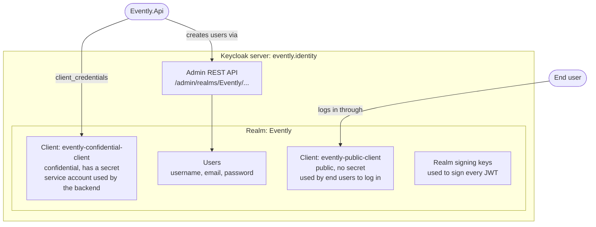
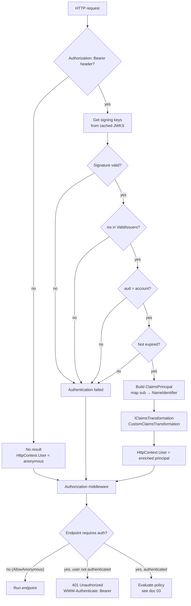
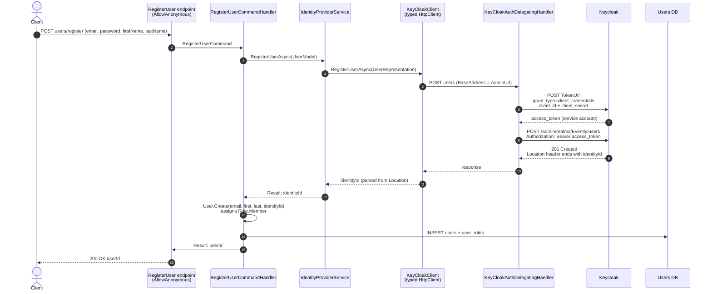

# 02 – Authentication with Keycloak

[← Back to index](README.md) · [← 01 – Claims](01-claims.md)

**Authentication** answers "who are you?". Evently does not store passwords and has no login endpoint. It hands that job to **Keycloak**, an OpenID Connect (OIDC) identity provider, and only **validates the tokens** Keycloak issues.

**Authorization** ("what may you do?") is handled by Evently itself. See [03](03-authorization-permissions.md).

## Keycloak building blocks



| Concept | In Evently |
| --- | --- |
| **Realm** | `Evently`. An isolated space with its own users, clients and signing keys. |
| **Public client** | `evently-public-client`. Used by front ends and tools (Postman, Scalar) to log users in. It cannot keep a secret, so it has none. |
| **Confidential client** | `evently-confidential-client`. Used by the API itself, machine to machine, with a client secret. Its service account must have the `manage-users` role of the `realm-management` client so it can create users through the Admin API. |
| **Access token** | A signed JWT that Keycloak gives the client after login. The API only accepts requests carrying a valid one. |
| **Discovery document** | `/.well-known/openid-configuration`. Tells the API the issuer, token endpoint and where to download the public signing keys (`jwks_uri`). |

### Local setup (docker-compose)

The `evently.identity` service in [`docker-compose.yml`](../../docker-compose.yml) runs `quay.io/keycloak/keycloak` in `start-dev` mode:

| Setting | Value |
| --- | --- |
| Admin console (from the host) | `http://localhost:18080` (user `admin` / `admin`) |
| Inside the docker network | `http://evently.identity:8080` |
| Health endpoint (management port) | `http://evently.identity:9000/health/ready`, used by the API health check (`KeyCloak:HealthUrl`) |
| Data | persisted in `./.containers/identity` |

## Two ways Evently talks to Keycloak

Evently uses Keycloak in two separate flows. Keep them apart:

| | Flow A: validating user tokens | Flow B: registering users |
| --- | --- | --- |
| Direction | Client → **API** (API only *reads* Keycloak's public keys) | **API** → Keycloak Admin API |
| Keycloak client | `evently-public-client` (the user logs in with it) | `evently-confidential-client` (the API logs in as itself) |
| OAuth grant | Authorization Code (SPA) or Password (dev/testing) | Client Credentials |
| Code | `Evently.Shared.Infrastructure/Authentication` | `Evently.Modules.Users.Infrastructure/Identity` |
| Config section | `Authentication` in `appsettings.json` | `Users:KeyCloak` in `modules.users.json` |

---

## Flow A: validating the bearer token

### Registration in DI

[`AuthenticationExtensions`](../../src/Shared/Evently.Shared.Infrastructure/Authentication/AuthenticationExtensions.cs), called from `AddInfrastructure(...)`:

```csharp
services.AddAuthorization();
services.AddAuthentication().AddJwtBearer();
services.AddHttpContextAccessor();
services.ConfigureOptions<JwtBearerConfigureOptions>();
```

- `AddJwtBearer()` registers the `Bearer` scheme. It is the only scheme, so ASP.NET Core uses it as the default without further setup.
- No options are passed inline. [`JwtBearerConfigureOptions`](../../src/Shared/Evently.Shared.Infrastructure/Authentication/JwtBearerConfigureOptions.cs) binds the `Authentication` configuration section onto `JwtBearerOptions`, so all settings live in configuration:

```csharp
public void Configure(JwtBearerOptions options)
{
    configuration.GetSection("Authentication").Bind(options);
}
```

It implements `IConfigureNamedOptions<JwtBearerOptions>` because the JWT bearer handler reads **named** options (named after the scheme, `Bearer`). The named overload ignores the name and applies the same configuration.

### Configuration

From [`appsettings.json`](../../src/API/Evently.Api/appsettings.json):

```json
"Authentication": {
  "Audience": "account",
  "TokenValidationParameters": {
    "ValidIssuers": [
      "http://evently.identity:8080/realms/Evently",
      "http://localhost:18080/realms/Evently"
    ]
  },
  "MetadataAddress": "http://evently.identity:8080/realms/Evently/.well-known/openid-configuration",
  "RequireHttpsMetadata": false
}
```

| Property (`JwtBearerOptions`) | Why this value |
| --- | --- |
| `MetadataAddress` | The OIDC discovery document. The API downloads it on first use, follows `jwks_uri` to fetch Keycloak's public signing keys and caches them. It uses the **docker hostname** because the API runs inside the compose network. |
| `TokenValidationParameters.ValidIssuers` | Keycloak writes the URL the token was requested from into `iss`. A token requested from the host via `localhost:18080` gets a different `iss` than one requested from inside docker via `evently.identity:8080`. Both are the same realm, so both are accepted. |
| `Audience` | Keycloak access tokens carry `"aud": "account"` by default. The API rejects tokens meant for another audience. |
| `RequireHttpsMetadata` | `false` only because local Keycloak runs on plain HTTP. Must be `true` in any real environment. |

### What happens on each request



A missing or invalid token does not fail the request right away. Authentication only sets `HttpContext.User`. The **authorization** middleware then decides: an endpoint marked `AllowAnonymous()` (e.g. `POST users/register`) still runs; a protected one returns **401**.

`CustomClaimsTransformation` runs only when authentication **succeeds**. It is covered in [03](03-authorization-permissions.md#customclaimstransformation--enrich-the-principal).

### Middleware order

In [`Program.cs`](../../src/API/Evently.Api/Program.cs):

```csharp
app.MapEndpoints();      // registers endpoints (does not execute them)
...
app.UseExceptionHandler();
app.UseAuthentication(); // sets HttpContext.User
app.UseAuthorization();  // enforces RequireAuthorization(...) metadata
app.Run();
```

`MapEndpoints()` appears before `UseAuthentication()`, and that is fine: `Map*` only **registers** endpoints. `WebApplication` adds routing at the start of the pipeline and endpoint execution at the end, so authentication and authorization always run before the endpoint delegate.

---

## Flow B: registering a user through the Keycloak Admin API

Evently has its own `users` table, but passwords live only in Keycloak. `POST users/register` therefore creates the user in **both** places and links them with `IdentityId`.



The pieces:

| Class | Role |
| --- | --- |
| [`IIdentityProviderService`](../../src/Modules/Users/Evently.Modules.Users.Application/Abstractions/Identity/IIdentityProviderService.cs) | Application-layer port. The handler doesn't know Keycloak exists. |
| [`IdentityProviderService`](../../src/Modules/Users/Evently.Modules.Users.Infrastructure/Identity/IdentityProviderService.cs) | Maps `UserModel` to Keycloak's `UserRepresentation` (username = email, `EmailVerified = true`, non-temporary password). Turns an HTTP **409 Conflict** into `IdentityProviderErrors.EmailIsNotUnique`. |
| [`KeyCloakClient`](../../src/Modules/Users/Evently.Modules.Users.Infrastructure/Identity/KeyCloakClient.cs) | Typed `HttpClient` with `BaseAddress = Users:KeyCloak:AdminUrl`. Reads the new user's id from the `Location` header of the 201 response. |
| [`KeyCloakAuthDelegatingHandler`](../../src/Modules/Users/Evently.Modules.Users.Infrastructure/Identity/KeyCloakAuthDelegatingHandler.cs) | Outgoing-request middleware. Gets a service-account token with the **client credentials** grant and attaches it as `Authorization: Bearer`. |
| [`KeyCloakOptions`](../../src/Modules/Users/Evently.Modules.Users.Infrastructure/Identity/KeyCloakOptions.cs) | Bound from `Users:KeyCloak`. |

Wiring, in [`UsersModule.cs`](../../src/Modules/Users/Evently.Modules.Users.Infrastructure/UsersModule.cs):

```csharp
services.Configure<KeyCloakOptions>(configuration.GetSection("Users:KeyCloak"));
services.AddTransient<KeyCloakAuthDelegatingHandler>();
services
    .AddHttpClient<KeyCloakClient>((sp, httpClient) =>
    {
        KeyCloakOptions o = sp.GetRequiredService<IOptions<KeyCloakOptions>>().Value;
        httpClient.BaseAddress = new Uri(o.AdminUrl);
    })
    .AddHttpMessageHandler<KeyCloakAuthDelegatingHandler>();
services.AddTransient<IIdentityProviderService, IdentityProviderService>();
```

`Users:KeyCloak` configuration ([`modules.users.json`](../../src/API/Evently.Api/modules.users.json)):

| Key | Example | Used by |
| --- | --- | --- |
| `AdminUrl` | `http://evently.identity:8080/admin/realms/Evently/` | `KeyCloakClient` base address. The trailing `/` matters: the relative path `users` is appended to it. |
| `TokenUrl` | `http://evently.identity:8080/realms/Evently/protocol/openid-connect/token` | Delegating handler, client credentials request |
| `ConfidentialClientId` | `evently-confidential-client` | Delegating handler |
| `ConfidentialClientSecret` | *(secret)* | Delegating handler |
| `PublicClientId` | `evently-public-client` | Not used by the backend yet |

> **Security note.** `ConfidentialClientSecret` grants admin rights over the realm's users. Keep it out of committed files outside local development. Use user secrets or an environment variable (`Users__KeyCloak__ConfidentialClientSecret`).

Things to know about this flow:

- **A new service-account token is requested for every Admin API call.** Fine for registration traffic; cache the token until it expires if the Admin API gets used more.
- **The two writes are not atomic.** If the Keycloak user is created but the database insert fails, Keycloak keeps a user with no Evently counterpart. That user can log in but every protected call fails in the claims transformation (see [04](04-walkthrough-get-user-profile.md#possible-outcomes)).
- Every new user gets `Role.Member` in `User.Create`. That role is what gives them permissions (see [03](03-authorization-permissions.md)).

---

## Trying it manually

1. Register a user (anonymous):

   ```http
   POST http://localhost:5000/users/register
   Content-Type: application/json

   { "email": "jane@evently.dev", "password": "Passw0rd!", "firstName": "Jane", "lastName": "Doe" }
   ```

2. Get an access token from Keycloak with the public client. The password grant below requires **Direct access grants** to be enabled on `evently-public-client`. Use it for local testing only; real front ends use the Authorization Code flow with PKCE.

   ```bash
   curl -X POST http://localhost:18080/realms/Evently/protocol/openid-connect/token \
     -d grant_type=password \
     -d client_id=evently-public-client \
     -d scope=openid \
     -d username=jane@evently.dev \
     -d password=Passw0rd!
   ```

3. Call a protected endpoint with the `access_token` from the response:

   ```http
   GET http://localhost:5000/users/profile
   Authorization: Bearer eyJhbGciOi...
   ```

   The token's `iss` will be `http://localhost:18080/realms/Evently`, which is why that URL is in `ValidIssuers`.

Paste the token into [jwt.io](https://jwt.io) or any JWT decoder to see the claims described in [01](01-claims.md).

Next: [03 – Permission-based authorization →](03-authorization-permissions.md)
