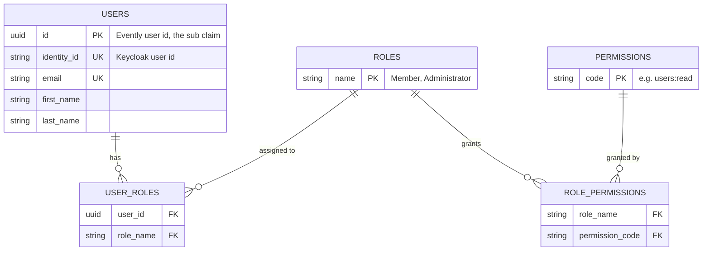
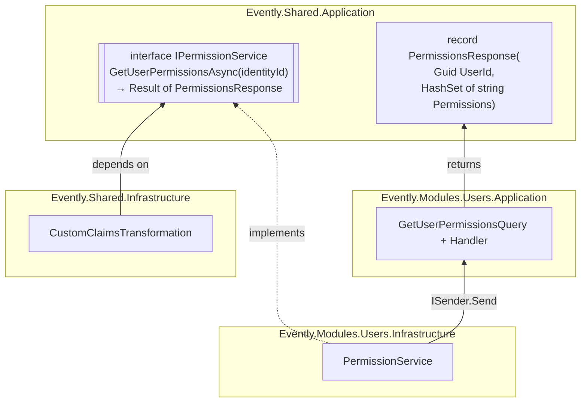
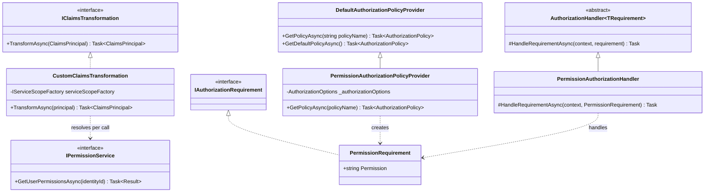
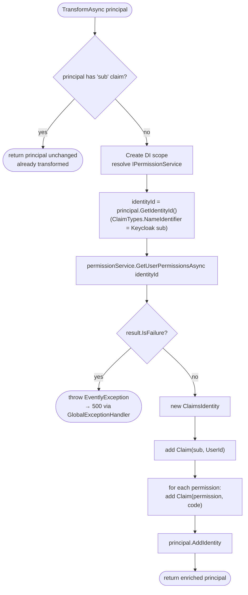
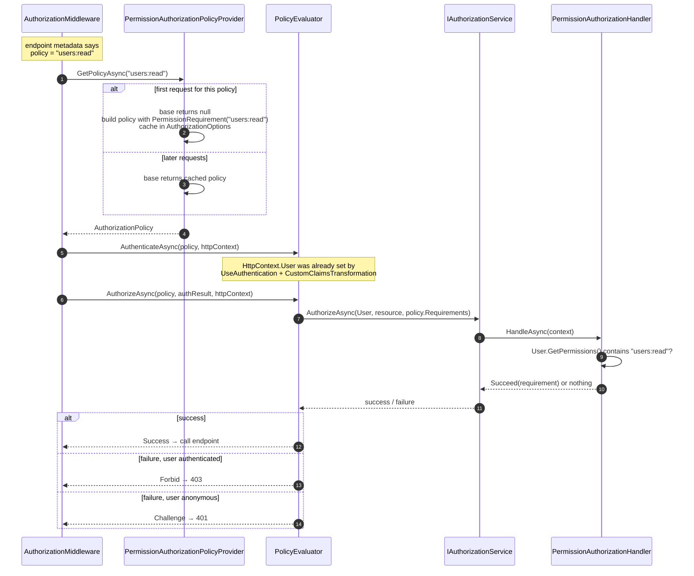
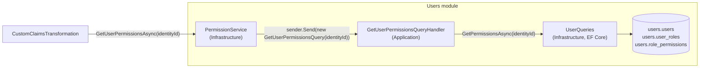

# 03 – Permission-based authorization

[← Back to index](README.md) · [← 02 – Authentication with Keycloak](02-authentication-keycloak.md)

Keycloak tells the API **who** the caller is. This document explains how Evently decides **what** they may do.

In short: each endpoint asks for one **permission** (`users:read`). Users get permissions through **roles** (`Member`, `Administrator`). Roles and permissions are stored in the **Users module's database**. On every authenticated request they are loaded and added to the principal as `permission` claims, and a custom authorization handler checks them.

## 1. The model: users → roles → permissions

The model is classic role-based access control (RBAC). Endpoints never check roles directly; they only check permissions. Roles are just named bundles of permissions.



All tables live in the `users` schema. Domain and EF Core mapping:

| Piece | File | Notes |
| --- | --- | --- |
| `Role` | [`Role.cs`](../../src/Modules/Users/Evently.Modules.Users.Domain/Users/Role.cs) | Fixed set: `Role.Member`, `Role.Administrator`. Key = `Name`. |
| `Permission` | [`Permission.cs`](../../src/Modules/Users/Evently.Modules.Users.Domain/Users/Permission.cs) | One static field per permission. Key = `Code`. |
| `User.Roles` | [`User.cs`](../../src/Modules/Users/Evently.Modules.Users.Domain/Users/User.cs) | `User.Create(...)` always adds `Role.Member`. |
| `user_roles` | [`RoleConfiguration.cs`](../../src/Modules/Users/Evently.Modules.Users.Infrastructure/Database/Configurations/RoleConfiguration.cs) | Many-to-many `User` ↔ `Role`. Seeds both roles. |
| `role_permissions` | [`PermissionConfiguration.cs`](../../src/Modules/Users/Evently.Modules.Users.Infrastructure/Database/Configurations/PermissionConfiguration.cs) | Many-to-many `Role` ↔ `Permission`. Seeds all permissions and the role matrix below with `HasData`, so the migration inserts them. |

### Seeded role → permission matrix

| Permission | Member | Administrator |
| --- | :---: | :---: |
| `users:read` | ✅ | ✅ |
| `users:update` | ✅ | ✅ |
| `events:read` | | ✅ |
| `events:search` | ✅ | ✅ |
| `events:update` | | ✅ |
| `ticket-types:read` | ✅ | ✅ |
| `ticket-types:udpate` ⚠️ | | ✅ |
| `categories:read` | | ✅ |
| `categories:update` | | ✅ |
| `carts:read` | ✅ | ✅ |
| `carts:add` | ✅ | ✅ |
| `carts:remove` | ✅ | ✅ |
| `orders:read` | ✅ | ✅ |
| `orders:create` | ✅ | ✅ |
| `tickets:read` | ✅ | ✅ |
| `tickets:check-in` | ✅ | ✅ |
| `event-statistics:read` | | ✅ |

> ⚠️ `Permission.ModifyTicketTypes` is seeded as `ticket-types:udpate` (typo). An endpoint written as `RequireAuthorization("ticket-types:update")` would return 403 for everyone. Fixing it needs a new migration, because the code is a primary key and is referenced by `role_permissions`.

### Why not use Keycloak roles?

Keycloak can put roles in the token (`realm_access.roles`), but Evently keeps authorization data in its own database:

- Permissions are defined next to the code that checks them and ship with migrations.
- The identity provider could be replaced without touching authorization.
- Tokens stay small, and a permission change takes effect on the next request without waiting for a new token.

The cost is one database query per authenticated request (see [Design notes](#6-design-notes-and-caveats)).

## 2. The abstraction: shared plumbing, module-owned data

The ASP.NET Core wiring (claims transformation, policy provider, handler) is the same for every module, so it lives in `Evently.Shared.Infrastructure`. But **only the Users module knows about users, roles and permissions**, and shared code must never reference a module.

This is solved with dependency inversion. Shared code depends on an interface in `Evently.Shared.Application`, and the Users module implements it:



```csharp
// Evently.Shared.Application/Authorization
public interface IPermissionService
{
    Task<Result<PermissionsResponse>> GetUserPermissionsAsync(string identityId);
}

public sealed record PermissionsResponse(Guid UserId, HashSet<string> Permissions);
```

```csharp
// Evently.Modules.Users.Infrastructure/UsersModule.cs
services.AddScoped<IPermissionService, PermissionService>();
```

What this buys:

- `Evently.Shared.Infrastructure` has no reference to the Users module.
- Other modules (Events, Ticketing) get permission checks for free. They only write `RequireAuthorization("events:update")`.
- The Users module owns the data and the query. If it were extracted into a separate service, only `PermissionService` would change (e.g. into an HTTP call).

## 3. The shared classes, one by one

All in [`src/Shared/Evently.Shared.Infrastructure/Authorization`](../../src/Shared/Evently.Shared.Infrastructure/Authorization/). They plug into ASP.NET Core's authorization system through its extension points:



### `AuthorizationExtensions` — registration

```csharp
internal static IServiceCollection AddAuthorizationInternal(this IServiceCollection services)
{
    services.AddTransient<IClaimsTransformation, CustomClaimsTransformation>();
    services.AddTransient<IAuthorizationHandler, PermissionAuthorizationHandler>();
    services.AddTransient<IAuthorizationPolicyProvider, PermissionAuthorizationPolicyProvider>();
    return services;
}
```

Called from `InfrastructureConfiguration.AddInfrastructure(...)`, right after `AddAuthenticationInternal()`.

| Service | Implementation | Effect |
| --- | --- | --- |
| `IClaimsTransformation` | `CustomClaimsTransformation` | Replaces the framework's no-op transformation. When one service is resolved, the last registration wins. |
| `IAuthorizationHandler` | `PermissionAuthorizationHandler` | **Added** to the list of handlers. ASP.NET Core runs every registered handler. |
| `IAuthorizationPolicyProvider` | `PermissionAuthorizationPolicyProvider` | Replaces `DefaultAuthorizationPolicyProvider`, which it extends. |

### `CustomClaimsTransformation` — enrich the principal

[Source](../../src/Shared/Evently.Shared.Infrastructure/Authorization/CustomClaimsTransformation.cs)

Runs right after the JWT has been validated. It turns a "Keycloak user" into an "Evently user with permissions".



Details worth knowing:

- **Why `IServiceScopeFactory`?** `IPermissionService` is scoped (it ends up using `UsersDbContext`). The transformation creates its own short-lived scope, so it can resolve scoped services no matter which lifetime it was itself resolved with.
- **Why a new `ClaimsIdentity`?** The JWT identity stays exactly as Keycloak issued it. Evently's claims sit in their own identity, and `FindFirst`/`FindAll` search all identities anyway. See [01 – Claims](01-claims.md#claims-that-evently-adds).
- **Why the `sub` guard?** It prevents a second run from querying the database again and adding duplicate claims. It depends on Keycloak's `sub` having been renamed to `NameIdentifier`. See [the caveat in 01](01-claims.md#why-reuse-the-name-sub).

### `PermissionAuthorizationPolicyProvider` — a policy for every permission, on demand

[Source](../../src/Shared/Evently.Shared.Infrastructure/Authorization/PermissionAuthorizationPolicyProvider.cs)

`RequireAuthorization("users:read")` means "apply the **policy** named `users:read`". Normally every policy has to be registered at startup:

```csharp
// what we would need WITHOUT the custom provider, one line per permission:
services.AddAuthorizationBuilder()
    .AddPolicy("users:read", p => p.AddRequirements(new PermissionRequirement("users:read")))
    .AddPolicy("users:update", p => p.AddRequirements(new PermissionRequirement("users:update")))
    // ... and so on for every permission
```

The custom provider builds these policies on demand instead:

```csharp
public override async Task<AuthorizationPolicy?> GetPolicyAsync(string policyName)
{
    AuthorizationPolicy? policy = await base.GetPolicyAsync(policyName);   // 1
    if (policy is not null)
    {
        return policy;
    }

    AuthorizationPolicy permissionPolicy = new AuthorizationPolicyBuilder()
        .AddRequirements(new PermissionRequirement(policyName))            // 2
        .Build();

    _authorizationOptions.AddPolicy(policyName, permissionPolicy);          // 3
    return permissionPolicy;
}
```

1. Ask the default provider first. Policies registered explicitly with `AddPolicy(...)` keep working.
2. Otherwise **treat the policy name as a permission code** and build a policy with a single `PermissionRequirement`.
3. Store it in `AuthorizationOptions` (a singleton via `IOptions`), so the next lookup is served by step 1.

`RequireAuthorization()` **without** a name does not go through `GetPolicyAsync`. It uses the default policy (`GetDefaultPolicyAsync`, inherited), which only requires an authenticated user and checks no permissions.

### `PermissionRequirement` — the "what"

[Source](../../src/Shared/Evently.Shared.Infrastructure/Authorization/PermissionRequirement.cs)

```csharp
internal sealed class PermissionRequirement : IAuthorizationRequirement
{
    public string Permission { get; }
    ...
}
```

A plain data holder. `IAuthorizationRequirement` is a marker interface. It says *what* must hold ("caller has permission X"), not *how* to check it.

### `PermissionAuthorizationHandler` — the "how"

[Source](../../src/Shared/Evently.Shared.Infrastructure/Authorization/PermissionAuthorizationHandler.cs)

```csharp
protected override Task HandleRequirementAsync(AuthorizationHandlerContext context, PermissionRequirement requirement)
{
    HashSet<string> permissions = context.User.GetPermissions();   // all "permission" claims

    if (permissions.Contains(requirement.Permission))
    {
        context.Succeed(requirement);
    }

    return Task.CompletedTask;
}
```

- `AuthorizationHandler<PermissionRequirement>` is called only for requirements of that type.
- It never calls `context.Fail()`. It simply doesn't succeed. The policy fails if no handler marked the requirement as succeeded. Another handler could still satisfy the same requirement (e.g. a future "super admin" handler).
- The check is a plain set lookup. Nothing is loaded here; the claims transformation already put the permissions on the principal.

### How the pieces meet at runtime



## 4. The Users module implementation

`CustomClaimsTransformation` calls `IPermissionService`. In the Users module the call goes through a normal CQRS query:



### `PermissionService`

[Source](../../src/Modules/Users/Evently.Modules.Users.Infrastructure/Authorization/PermissionService.cs). A thin adapter: it sends the query through MediatR, so the same pipeline behaviors (exception handling, request logging) apply as for any other query.

```csharp
internal sealed class PermissionService(ISender sender) : IPermissionService
{
    public async Task<Result<PermissionsResponse>> GetUserPermissionsAsync(string identityId)
        => await sender.Send(new GetUserPermissionsQuery(identityId));
}
```

### `GetUserPermissionsQueryHandler`

[Source](../../src/Modules/Users/Evently.Modules.Users.Application/Users/Queries/GetUserPermissions/GetUserPermissionsQueryHandler.cs)

```csharp
List<UserPermissionViewModel> permissions = await queries.GetPermissionsAsync(request.IdentityId, cancellationToken);

if (permissions.Count == 0)
{
    return Result.Failure<PermissionsResponse>(UserErrors.NotFound(request.IdentityId));
}

return new PermissionsResponse(permissions[0].UserId, permissions.Select(p => p.Permission).ToHashSet());
```

The query returns one row per `(UserId, Permission)`. The user id is the same on every row, so it is taken from the first. **An empty result means "not found"**: either no Evently user has this `identity_id`, or the user exists but has no role that grants a permission.

### `UserQueries.GetPermissionsAsync`

[Source](../../src/Modules/Users/Evently.Modules.Users.Infrastructure/Queries/UserQueries.cs)

The many-to-many join tables have no CLR class. EF Core maps them as *shared-type entities* (property bags) with the default names `RoleUser` and `PermissionRole`, so the query uses `context.Set<Dictionary<string, object>>(...)` and `EF.Property<T>(...)`:

```csharp
from u in context.Users
join ur in context.Set<Dictionary<string, object>>("RoleUser")
    on u.Id equals EF.Property<Guid>(ur, "UserId")
join rp in context.Set<Dictionary<string, object>>("PermissionRole")
    on EF.Property<string>(ur, "RolesName") equals EF.Property<string>(rp, "RoleName")
where u.IdentityId == identityId
select new UserPermissionViewModel { UserId = u.Id, Permission = EF.Property<string>(rp, "PermissionCode") }
```

Roughly equivalent SQL:

```sql
SELECT DISTINCT u.id AS user_id, rp.permission_code AS permission
FROM users.users u
JOIN users.user_roles       ur ON ur.user_id   = u.id
JOIN users.role_permissions rp ON rp.role_name = ur.role_name
WHERE u.identity_id = @identityId;
```

`DISTINCT` removes duplicates when two roles grant the same permission (an Administrator who is also a Member).

## 5. Endpoints today

| Style | Checks | Endpoints |
| --- | --- | --- |
| `.RequireAuthorization("users:read")` | authenticated **and** has permission | `GET users/profile` |
| `.RequireAuthorization()` | authenticated only (default policy) | every other Events, Ticketing and Users endpoint |
| `.AllowAnonymous()` | nothing | `POST users/register` |

Moving the remaining endpoints to permissions only means passing the code, e.g. `.RequireAuthorization("events:update")`. No other code changes are needed. See [04](04-walkthrough-get-user-profile.md#protecting-a-new-endpoint).

## 6. Design notes and caveats

| Topic | Current behavior | Consider |
| --- | --- | --- |
| **One DB query per authenticated request** | The transformation runs on every request with a valid token. | Cache `PermissionsResponse` per `identityId` for a short time with the existing `ICacheService`, and invalidate it when roles change. |
| **Unknown user → 500** | Valid Keycloak token but no Evently user (or no roles): the query fails, the transformation throws `EventlyException`, `GlobalExceptionHandler` returns **500**. This also happens on `AllowAnonymous` endpoints if a token is sent. | Return the principal unchanged (no permissions), so protected endpoints answer 403 instead. |
| **Any policy name is a permission** | A typo such as `RequireAuthorization("user:read")` compiles and silently becomes a permission nobody has → always 403. | Use constants for permission codes in presentation code instead of string literals. |
| **Caching into `AuthorizationOptions`** | `AddPolicy` writes into a plain dictionary that isn't meant for concurrent writes. Two first requests for the same new policy at the same time can race. | Cache in a `ConcurrentDictionary` inside the provider, or just return the freshly built policy (building one is cheap). |
| **Authorization on resources** | Permissions answer "may this user update profiles?", not "may this user update **this** profile?". `PUT users/{id}/profile` only requires an authenticated user, so any user can target any `id`. | Take the id from `claims.GetUserId()` instead of the route, or add a resource-based check. |

Next: [04 – Walkthrough: `GET users/profile` →](04-walkthrough-get-user-profile.md)
