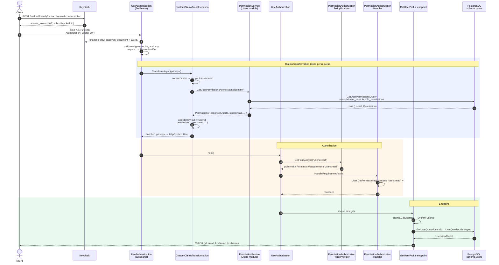
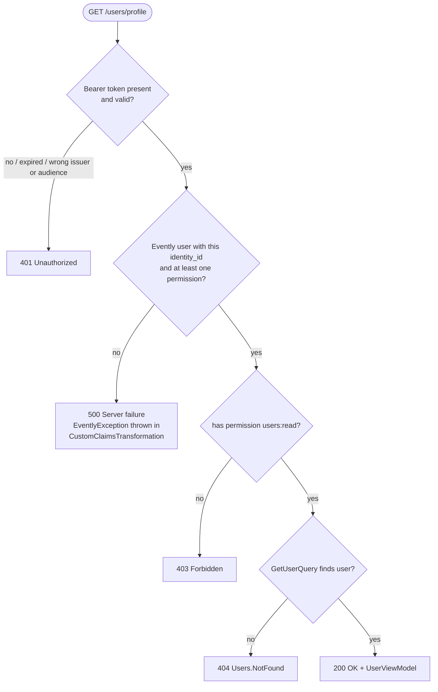

# 04 – Walkthrough: `GET users/profile`

[← Back to index](README.md) · [← 03 – Permission-based authorization](03-authorization-permissions.md)

This document follows one real request through everything described in docs 01–03. The endpoint is [`GetUserProfile`](../../src/Modules/Users/Evently.Modules.Users.Presentation/Users/GetUserProfile.cs) in the Users module.

## The endpoint

```csharp
internal sealed class GetUserProfile : IEndpoint
{
    public void MapEndpoint(IEndpointRouteBuilder app)
    {
        app.MapGet("users/profile", async (ClaimsPrincipal claims, ISender sender) =>   // (A)
        {
            Result<UserViewModel> result = await sender.Send(
                new GetUserQuery(claims.GetUserId()));                                  // (B)

            return result.Match(Results.Ok, ApiResults.Problem);                        // (C)
        })
        .RequireAuthorization("users:read")                                             // (D)
        .WithTags(Tags.Users);
    }
}
```

| Mark | What it does | Covered in |
| --- | --- | --- |
| **(D)** | Attaches authorization metadata with policy name `users:read`. Checked **before** the delegate runs. | [03 – policy provider](03-authorization-permissions.md#permissionauthorizationpolicyprovider--a-policy-for-every-permission-on-demand) |
| **(A)** | Minimal APIs bind `ClaimsPrincipal` to `HttpContext.User`, the principal already enriched by `CustomClaimsTransformation`. | [01 – Claims](01-claims.md) |
| **(B)** | `GetUserId()` reads the `sub` claim that **Evently** added (the Evently `User.Id`), not Keycloak's id. | [01 – Reading claims](01-claims.md#reading-claims-claimsprincipalextensions) |
| **(C)** | `Result` → `200 OK` with the `UserViewModel`, or a ProblemDetails response (`UserErrors.NotFound` → 404). | |

Note what the route does **not** have: an `{id}` parameter. The user to load comes from the validated token, so a caller can only ever read **their own** profile. There is no id to tamper with.

## The request end to end



A successful call makes **two** database round trips: one for permissions (claims transformation) and one for the profile (the endpoint).

### Step by step

1. **Login (outside Evently).** The client gets a JWT from Keycloak's token endpoint. The token's `sub` is the Keycloak user id.
2. **Authentication.** `JwtBearer` validates the token against the keys from the discovery document (downloaded once, then cached) and the `Authentication` settings. The inbound mapping turns `sub` into `ClaimTypes.NameIdentifier`.
3. **Claims transformation.** No `sub` claim is present (it was renamed), so `CustomClaimsTransformation` calls `IPermissionService` with the Keycloak id. The Users module finds the matching `users.users.identity_id` row, joins through roles to permissions and returns `(UserId, Permissions)`. A new `ClaimsIdentity` with `sub = UserId` and one `permission` claim per code is added to the principal.
4. **Authorization.** The endpoint metadata asks for policy `users:read`. `PermissionAuthorizationPolicyProvider` returns a policy with `PermissionRequirement("users:read")`, built and cached the first time. `PermissionAuthorizationHandler` finds `users:read` among the `permission` claims and succeeds.
5. **Endpoint.** `claims.GetUserId()` reads the `sub` claim added in step 3. `GetUserQuery` loads the profile, and the result is mapped to `200 OK`.

## Possible outcomes



| Scenario | Result | Why |
| --- | --- | --- |
| No `Authorization` header | **401** | Anonymous user. The permission requirement fails and the middleware *challenges*. |
| Expired token, bad signature, wrong `iss`/`aud` | **401** | `JwtBearer` authentication fails, so the user is anonymous. |
| Valid token, but the user registered in Keycloak only (e.g. the DB insert failed during registration) | **500** | `GetUserPermissionsQuery` returns `Users.NotFound`, and the transformation throws. |
| Valid token, user exists, role lacks `users:read` | **403** | Authenticated but the requirement fails, so the middleware *forbids*. Can't happen with the seeded data: both `Member` and `Administrator` have `users:read`. |
| Valid token, user exists with `Member` or `Administrator` | **200** | Happy path. |
| Permissions found but profile not found | **404** | Only possible if the user is deleted between the two queries. |

## Protecting a new endpoint

Example: protect `PUT events/{id}/publish` with a new permission `events:publish`.

1. **Declare the permission** in [`Permission.cs`](../../src/Modules/Users/Evently.Modules.Users.Domain/Users/Permission.cs):

   ```csharp
   public static readonly Permission PublishEvents = new("events:publish");
   ```

2. **Seed it and grant it to roles** in [`PermissionConfiguration.cs`](../../src/Modules/Users/Evently.Modules.Users.Infrastructure/Database/Configurations/PermissionConfiguration.cs). Add it to the `builder.HasData(...)` list, then to the join table's `HasData(...)`:

   ```csharp
   CreateRolePermission(Role.Administrator, Permission.PublishEvents),
   ```

3. **Add a migration** for the Users module (from `src/API/Evently.Api`, as described in the root [README](../../README.md#migrations)):

   ```powershell
   dotnet ef migrations add AddPublishEventsPermission -c UsersDbContext -o Database\Migrations -p ..\..\Modules\Users\Evently.Modules.Users.Infrastructure\Evently.Modules.Users.Infrastructure.csproj
   ```

4. **Require it on the endpoint.** No policy registration is needed; the policy provider creates it the first time it is requested:

   ```csharp
   app.MapPut("events/{id}/publish", ...)
      .RequireAuthorization("events:publish")
      .WithTags(Tags.Events);
   ```

5. **If the endpoint needs the current user**, inject `ClaimsPrincipal` and call `GetUserId()`, as `GetUserProfile` does. `ClaimsPrincipalExtensions` lives in `Evently.Shared.Infrastructure`. Today only `Evently.Modules.Users.Presentation` references that project; the Events and Ticketing presentation projects would need the reference too (or the extensions could move to a lower shared layer).

Nothing changes in `Evently.Shared.Infrastructure/Authorization`. That is the point of the abstraction: new permissions are **data** (a row plus a string on the endpoint), not new code.

[← Back to index](README.md)
