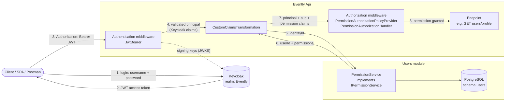
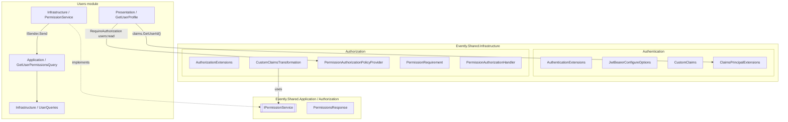

# Authentication & Authorization in Evently

This folder explains how Evently decides **who** is calling the API (authentication) and **what** they are allowed to do (authorization).

| Doc | What it covers |
| --- | --- |
| [01 – Claims](01-claims.md) | Claims, `ClaimsIdentity`, `ClaimsPrincipal`, which claims arrive from Keycloak and which ones Evently adds |
| [02 – Authentication with Keycloak](02-authentication-keycloak.md) | Keycloak concepts, JWT bearer validation, configuration, user registration against the Keycloak Admin API |
| [03 – Permission-based authorization](03-authorization-permissions.md) | The RBAC model (users → roles → permissions) and the shared abstractions in `Evently.Shared.Infrastructure/Authorization` |
| [04 – Walkthrough: `GET users/profile`](04-walkthrough-get-user-profile.md) | One request traced end to end, the possible outcomes, and how to protect a new endpoint |

## The big picture

Keycloak **authenticates** users and issues JWT access tokens. Evently **authorizes** them: roles and permissions live in Evently's own database, in the Users module, not in Keycloak.

1. The client logs in against Keycloak (not against Evently).
2. Keycloak returns a signed JWT.
3. The client sends the JWT on every API call.
4. `JwtBearer` validates the token (signature, issuer, audience, lifetime) and builds a `ClaimsPrincipal`.
5. `CustomClaimsTransformation` takes the Keycloak user id and asks `IPermissionService` for that user's data.
6. The Users module resolves the Evently user id and the permissions granted by the user's roles.
7. These are added to the principal as extra claims: `sub` holds the Evently user id, `permission` holds each permission code.
8. The authorization middleware checks that the permission the endpoint asks for (e.g. `users:read`) is among the user's `permission` claims.

## Where the code lives

| Concern | File |
| --- | --- |
| Register authN + authZ services | [`InfrastructureConfiguration.cs`](../../src/Shared/Evently.Shared.Infrastructure/InfrastructureConfiguration.cs) |
| JWT bearer setup | [`Authentication/AuthenticationExtensions.cs`](../../src/Shared/Evently.Shared.Infrastructure/Authentication/AuthenticationExtensions.cs), [`Authentication/JwtBearerConfigureOptions.cs`](../../src/Shared/Evently.Shared.Infrastructure/Authentication/JwtBearerConfigureOptions.cs) |
| Claim names + helpers | [`Authentication/CustomClaims.cs`](../../src/Shared/Evently.Shared.Infrastructure/Authentication/CustomClaims.cs), [`Authentication/ClaimsPrincipalExtensions.cs`](../../src/Shared/Evently.Shared.Infrastructure/Authentication/ClaimsPrincipalExtensions.cs) |
| Permission pipeline | [`Authorization/*`](../../src/Shared/Evently.Shared.Infrastructure/Authorization/) |
| Contract between shared and module | [`Evently.Shared.Application/Authorization/*`](../../src/Shared/Evently.Shared.Application/Authorization/) |
| Users module implementation | [`PermissionService.cs`](../../src/Modules/Users/Evently.Modules.Users.Infrastructure/Authorization/PermissionService.cs), [`GetUserPermissions/*`](../../src/Modules/Users/Evently.Modules.Users.Application/Users/Queries/GetUserPermissions/), [`UserQueries.cs`](../../src/Modules/Users/Evently.Modules.Users.Infrastructure/Queries/UserQueries.cs) |
| Roles, permissions, seed data | [`Role.cs`](../../src/Modules/Users/Evently.Modules.Users.Domain/Users/Role.cs), [`Permission.cs`](../../src/Modules/Users/Evently.Modules.Users.Domain/Users/Permission.cs), [`RoleConfiguration.cs`](../../src/Modules/Users/Evently.Modules.Users.Infrastructure/Database/Configurations/RoleConfiguration.cs), [`PermissionConfiguration.cs`](../../src/Modules/Users/Evently.Modules.Users.Infrastructure/Database/Configurations/PermissionConfiguration.cs) |
| Keycloak Admin API client (registration) | [`Identity/*`](../../src/Modules/Users/Evently.Modules.Users.Infrastructure/Identity/) |
| Sample protected endpoint | [`GetUserProfile.cs`](../../src/Modules/Users/Evently.Modules.Users.Presentation/Users/GetUserProfile.cs) |

## Glossary

| Term | Meaning in Evently |
| --- | --- |
| **Identity id** | The user's id in Keycloak (a UUID). Stored in `users.users.identity_id`. Read with `ClaimsPrincipal.GetIdentityId()`. |
| **User id** | The user's id in Evently (`User.Id`, a `Guid`). Read with `ClaimsPrincipal.GetUserId()`. |
| **Role** | A named group of permissions (`Member`, `Administrator`). Stored in Evently, not in Keycloak. |
| **Permission** | A string code like `users:read`. Endpoints ask for one; users get them through their roles. |
| **Policy** | ASP.NET Core authorization policy. In Evently, a policy's **name is the permission code**. |
