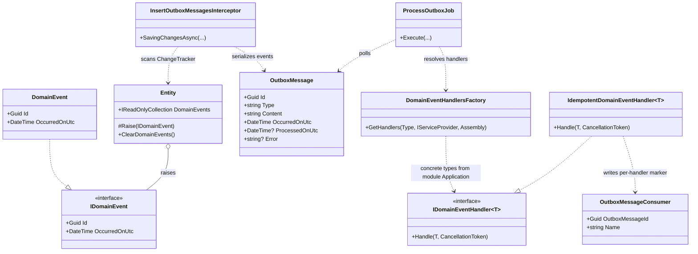
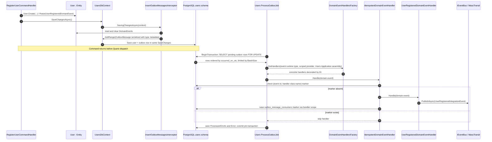

# Domain events and outbox: inside one module

[Overview](README.md) · [Integration events and inbox →](02-integration-events-and-inbox.md)

## Responsibilities and class relationships

[`Entity`](../../src/Shared/Evently.Shared.Domain/Entity.cs) owns pending `IDomainEvent`s; [`DomainEvent`](../../src/Shared/Evently.Shared.Domain/DomainEvents/DomainEvent.cs) assigns a GUID v7 and UTC timestamp. For example, [`User.Create`](../../src/Modules/Users/Evently.Modules.Users.Domain/Users/User.cs) raises `UserRegisteredDomainEvent` and [`RegisterUserCommandHandler`](../../src/Modules/Users/Evently.Modules.Users.Application/Users/Commands/RegisterUser/RegisterUserCommandHandler.cs) calls `IUnitOfWork.SaveChangesAsync`.

## Write and dispatch sequence

[`InsertOutboxMessagesInterceptor`](../../src/Shared/Evently.Shared.Infrastructure/Outbox/InsertOutboxMessagesInterceptor.cs) runs on **async** EF `SavingChangesAsync` in all four module `DbContext`s. It scans tracked `Entity` instances, copies and clears pending events, serializes them using [`SerializerSettings`](../../src/Shared/Evently.Shared.Infrastructure/Serialization/SerializerSettings.cs) (`TypeNameHandling.All`), and adds `OutboxMessage` records to that same context. Each context uses its own default schema: [`EventsDbContext`](../../src/Modules/Events/Evently.Modules.Events.Infrastructure/Database/EventsDbContext.cs), [`UsersDbContext`](../../src/Modules/Users/Evently.Modules.Users.Infrastructure/Database/UsersDbContext.cs), [`TicketingDbContext`](../../src/Modules/Ticketing/Evently.Modules.Ticketing.Infrastructure/Database/TicketingDbContext.cs), [`AttendanceDbContext`](../../src/Modules/Attendance/Evently.Modules.Attendance.Infrastructure/Database/AttendanceDbContext.cs). No synchronous `SavingChanges` override appears in this interceptor.

Each module's [`ProcessOutboxJob`](../../src/Modules/Users/Evently.Modules.Users.Infrastructure/Outbox/ProcessOutboxJob.cs) begins a transaction, selects pending rows ordered by `occurred_on_utc` with `LIMIT BatchSize FOR UPDATE`, deserializes `IDomainEvent`, then creates a **new DI scope per row**. [`DomainEventHandlersFactory`](../../src/Shared/Evently.Shared.Infrastructure/Outbox/DomainEventHandlersFactory.cs) caches handler **types** by `(Application assembly, event type)` and resolves fresh scoped instances. Modules register Application handlers by concrete type, decorated with module-local [`IdempotentDomainEventHandler<T>`](../../src/Modules/Users/Evently.Modules.Users.Infrastructure/Outbox/IdempotentDomainEventHandler.cs). One domain event can have multiple handlers; each gets its own marker keyed by `(OutboxMessageId, Name)`.

**Important distinction:** job's transaction and handler's `DbContext` belong to different scopes. Handler/decorator `SaveChangesAsync` calls are **not automatically in job's transaction**. Publishing to MassTransit also happens outside database transaction. Diagram shows call order, **not** one atomic cross-context/bus commit; see [exact DB read/write timeline and errors](04-database-reads-writes-and-retries.md).

## When does domain event become integration event?

Only when a domain handler explicitly publishes one. Example: [`UserRegisteredDomainEventHandler`](../../src/Modules/Users/Evently.Modules.Users.Application/Users/DomainEventHandlers/UserRegisteredDomainEventHandler.cs) reads user profile and calls [`IEventBus.PublishAsync`](../../src/Shared/Evently.Shared.Application/EventBus/IEventBus.cs) with `UserRegisteredIntegrationEvent`. It passes original domain event's `Id` and `OccurredOnUtc`. [`EventPublishedDomainEventHandler`](../../src/Modules/Events/Evently.Modules.Events.Application/Events/DomainEventHandlers/EventPublishedDomainEventHandler.cs) likewise publishes `EventPublishedIntegrationEvent`. Other handlers may perform only local work; an outbox row does **not** inherently mean a bus message.
