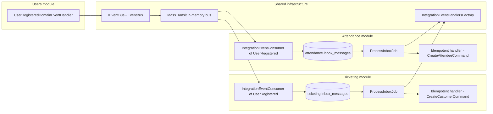
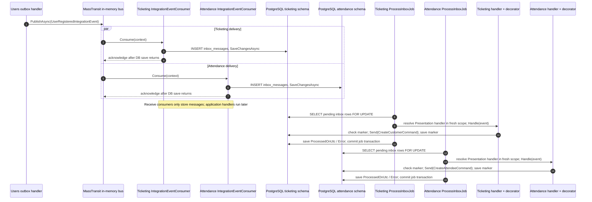
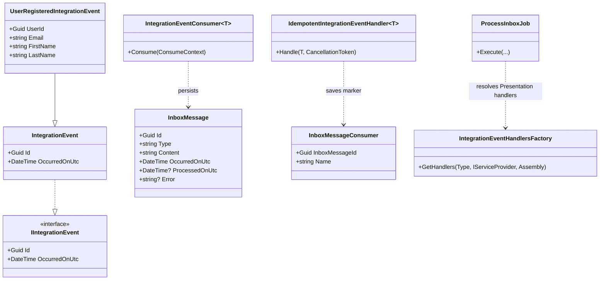

# Integration events and inbox: between modules

[← Domain events and outbox](01-domain-events-and-outbox.md) · [Overview](README.md) · [Operations →](03-operations-and-failure-modes.md)

## Components and contracts

`IEventBus` is implemented by [`EventBus`](../../src/Shared/Evently.Shared.Infrastructure/EventBus/EventBus.cs), which calls `IBus.Publish`. [`InfrastructureConfiguration`](../../src/Shared/Evently.Shared.Infrastructure/InfrastructureConfiguration.cs) configures MassTransit `UsingInMemory`, endpoint names with namespaces, and calls the consumer-registration callbacks supplied by [`Program.cs`](../../src/API/Evently.Api/Program.cs). Only [`TicketingModule.ConfigureConsumers`](../../src/Modules/Ticketing/Evently.Modules.Ticketing.Infrastructure/TicketingModule.cs) and [`AttendanceModule.ConfigureConsumers`](../../src/Modules/Attendance/Evently.Modules.Attendance.Infrastructure/AttendanceModule.cs) are passed; Events and Users have no active bus receiver registrations.

| Publishing module | Integration events *actually published* by its domain handlers | Registered receiving modules |
| --- | --- | --- |
| Users | `UserRegisteredIntegrationEvent`, `UserProfileUpdatedIntegrationEvent` | Ticketing, Attendance |
| Events | `EventPublishedIntegrationEvent`, `EventRescheduledIntegrationEvent` | Published → Ticketing + Attendance; Rescheduled → none registered |
| Ticketing | `TicketTypeSoldOutIntegrationEvent`, `TicketIssuedIntegrationEvent`, `TicketArchivedIntegrationEvent`, `OrderCreatedIntegrationEvent` | Issued → Attendance; others → none registered |
| Attendance | No `PublishAsync` call found in current domain handlers | — |

`TicketTypePriceChangedIntegrationEvent` has a **Ticketing receiver registration and handler**, but no publishing call found in current Events domain handlers. This table distinguishes event **types defined** from events **published or subscribed**. Source: [domain handler calls](../../src/Modules/Events/Evently.Modules.Events.Application/Events/DomainEventHandlers/), [Ticketing handlers](../../src/Modules/Ticketing/Evently.Modules.Ticketing.Application/Tickets/DomainEventHandlers/), [consumer registrations](../../src/Modules/Ticketing/Evently.Modules.Ticketing.Infrastructure/TicketingModule.cs).

## Receive and dispatch sequence: one event, two destinations

[`IntegrationEventConsumer<T>`](../../src/Modules/Attendance/Evently.Modules.Attendance.Infrastructure/Inbox/IntegrationEventConsumer.cs) serializes `context.Message`, copies `Id` and `OccurredOnUtc`, inserts `InboxMessage`, and calls `SaveChangesAsync`. It does **not** execute business logic. Equivalent consumers exist under Ticketing, Events, and Users infrastructure, but only Ticketing/Attendance receive registrations are wired into MassTransit. Each destination has its **own** inbox row with the **same** event ID.

Each module's [`ProcessInboxJob`](../../src/Modules/Attendance/Evently.Modules.Attendance.Infrastructure/Inbox/ProcessInboxJob.cs) polls unprocessed rows and deserializes `IIntegrationEvent`; [`IntegrationEventHandlersFactory`](../../src/Shared/Evently.Shared.Infrastructure/Inbox/IntegrationEventsHandlersFactory.cs) caches handler types by `(Presentation assembly, event type)` and resolves decorated handlers in a fresh per-message DI scope. Module registration decorates concrete Presentation handlers with [`IdempotentIntegrationEventHandler<T>`](../../src/Modules/Attendance/Evently.Modules.Attendance.Infrastructure/Inbox/IdempotentIntegrationEventHandler.cs). Decorator checks `(InboxMessageId, handler class name)` before invoking handler, then saves its marker. See [Ticketing customer handler](../../src/Modules/Ticketing/Evently.Modules.Ticketing.Presentation/Customers/UserRegisteredIntegrationEventHandler.cs) and [Attendance attendee handler](../../src/Modules/Attendance/Evently.Modules.Attendance.Presentation/Attendees/IntegrationEventHandlers/UserRegisteredIntegrationEventConsumer.cs).

## Type and handler model

Key distinction: `IntegrationEventConsumer<T>` is **MassTransit ingestion**; `IIntegrationEventHandler<T>` is **later Quartz dispatch**. Neither is same thing as `InboxMessageConsumer` (database marker). For exact save order and failure outcomes, see [DB reads, writes, and retries](04-database-reads-writes-and-retries.md). See [`IntegrationEvent`](../../src/Shared/Evently.Shared.Application/EventBus/IntegrationEvent.cs), [`InboxMessage`](../../src/Shared/Evently.Shared.Infrastructure/Inbox/InboxMessage.cs), and [`InboxMessageConsumer`](../../src/Shared/Evently.Shared.Infrastructure/Inbox/InboxMessageConsumer.cs).
