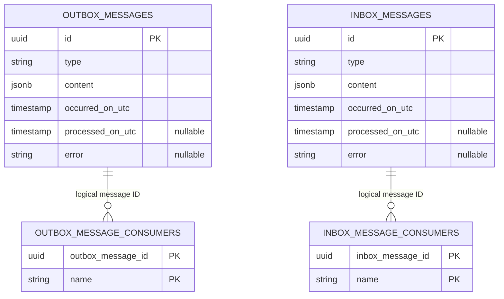
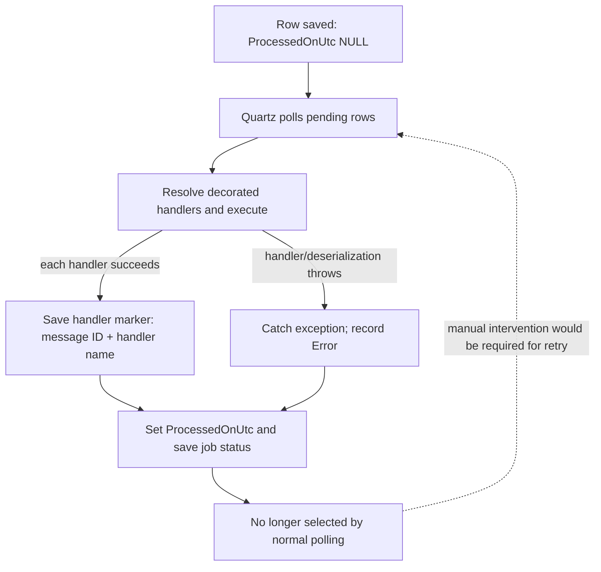

# Storage, jobs, and failure boundaries

[← Integration events and inbox](02-integration-events-and-inbox.md) · [Overview](README.md)

## Database layout (repeated per module)

**Diagram shows logical association, not a configured foreign key.** [`OutboxMessageConfiguration`](../../src/Shared/Evently.Shared.Infrastructure/Outbox/OutboxMessageConfiguration.cs) / [`InboxMessageConfiguration`](../../src/Shared/Evently.Shared.Infrastructure/Inbox/InboxMessageConfiguration.cs) map `Content` to PostgreSQL `jsonb` (maximum length configured as 2000); message `Id` is primary key. [`OutboxMessageConsumerConfiguration`](../../src/Shared/Evently.Shared.Infrastructure/Outbox/OutboxMessageConsumerConfiguration.cs) / [`InboxMessageConsumerConfiguration`](../../src/Shared/Evently.Shared.Infrastructure/Inbox/InboxMessageConsumerConfiguration.cs) define composite primary keys `(message ID, Name)`, with `Name` length 500. `Type` is a class name; runtime dispatch uses serialized .NET type metadata in `Content`, not the `Type` column. No FK relationship is configured in these classes.

Tables exist in `events`, `users`, `ticketing`, and `attendance` PostgreSQL schemas; each module applies these same shared mapping types in its own `DbContext` (see [all contexts](01-domain-events-and-outbox.md#write-and-dispatch-sequence)). Source: [shared serializer settings](../../src/Shared/Evently.Shared.Infrastructure/Serialization/SerializerSettings.cs), [message types](../../src/Shared/Evently.Shared.Infrastructure/Outbox/OutboxMessage.cs) and [inbox type](../../src/Shared/Evently.Shared.Infrastructure/Inbox/InboxMessage.cs).

## Scheduling and polling

| Item | Current implementation |
| --- | --- |
| Scheduler | Shared [`InfrastructureConfiguration`](../../src/Shared/Evently.Shared.Infrastructure/InfrastructureConfiguration.cs) registers Quartz + hosted service; each module registers outbox and inbox jobs. |
| Trigger | Module [`ConfigureProcessOutboxJob`](../../src/Modules/Users/Evently.Modules.Users.Infrastructure/Outbox/ConfigureProcessOutboxJob.cs) / [`ConfigureProcessInboxJob`](../../src/Modules/Users/Evently.Modules.Users.Infrastructure/Inbox/ConfigureProcessInboxJob.cs) schedule simple intervals from `<Module>:Outbox/Inbox:IntervalInSeconds`. |
| Batch | `<Module>:Outbox/Inbox:BatchSize` rows per run. Module JSON files under [`src/API/Evently.Api/`](../../src/API/Evently.Api/) show 5 seconds / 50 rows in base files, 15 seconds / 20 rows in `.Development.json` files. [`AddModuleConfiguration`](../../src/API/Evently.Api/Extensions/ConfigurationExtensions.cs) loads both file variants unconditionally, in that order. |
| Query | `WHERE processed_on_utc IS NULL ORDER BY occurred_on_utc LIMIT BatchSize FOR UPDATE` on module schema. Job wraps query and final status save in a transaction. |
| Concurrency | `[DisallowConcurrentExecution]` per job; SQL uses `FOR UPDATE` **without** `SKIP LOCKED`. Source comments assume a single instance and call out additional work for multiple instances. |

Example job sources: [Users outbox](../../src/Modules/Users/Evently.Modules.Users.Infrastructure/Outbox/ProcessOutboxJob.cs), [Users inbox](../../src/Modules/Users/Evently.Modules.Users.Infrastructure/Inbox/ProcessInboxJob.cs). Equivalent jobs exist in Events, Ticketing, Attendance.

## Status and idempotency

A decorator checks its marker before calling a handler, and records it **after** handler completion. This avoids re-running a successfully marked handler when the *same persisted message* is dispatched again. It is **not** an end-to-end exactly-once guarantee. Markers are saved using a fresh per-message DI scope and its own `DbContext`; the job's poll/status transaction uses another `DbContext`. The bus is in-memory, and publication is not committed atomically with either context. See [DB timeline and per-failure outcomes](04-database-reads-writes-and-retries.md) for exact ordering.

**On handler error:** both jobs catch per-row exceptions, log them, set `Error` to exception text **and still set `ProcessedOnUtc`**. Normal poll queries will not retry that row. Earlier handlers of the same row may already have completed; later handlers are skipped after first throw. Failed status is visible through `Error`, not `ProcessedOnUtc == null`. A later unhandled job-level failure (e.g., final save/commit) can leave pending rows for another run, even if handler side effects happened.

**On failed entity save:** [`InsertOutboxMessagesInterceptor`](../../src/Shared/Evently.Shared.Infrastructure/Outbox/InsertOutboxMessagesInterceptor.cs) clears pending events before EF completes `SaveChangesAsync`. If that save fails and the same tracked entities are retried without raising their events again, those in-memory pending events are gone. Interceptor does not override synchronous `SavingChanges`.

**On duplicate delivery:** inbox ingestion inserts a row using integration event `Id` as inbox primary key; [`IntegrationEventConsumer<T>`](../../src/Modules/Ticketing/Evently.Modules.Ticketing.Infrastructure/Inbox/IntegrationEventConsumer.cs) has no existing-row check. Re-delivering an already stored event to the same module can fail at `SaveChangesAsync` with a primary-key conflict. Per-handler marker checks run later, not during ingestion. Bus retry/error behavior beyond that is not configured here.

**On restarts:** domain-event outbox rows survive in PostgreSQL. Once a domain handler calls [`EventBus.PublishAsync`](../../src/Shared/Evently.Shared.Infrastructure/EventBus/EventBus.cs), the integration event travels via `UsingInMemory`: it is not itself persisted in a separate integration outbox or durable broker. A shutdown between publication and inbox persistence can lose delivery; publisher/handler effects and markering can diverge. Do not infer durable cross-module exactly-once semantics from the table names.

**On scaling:** Quartz's `[DisallowConcurrentExecution]` limits concurrent execution of a job identity within its scheduler, not a distributed lock for independently running API instances. `FOR UPDATE` serializes row access but without `SKIP LOCKED` a second worker can wait; code comments explicitly assume a single instance. Ordering is by occurrence timestamp for each batch, not a cross-module ordering guarantee.

## Where to change behavior

| Need | Look here |
| --- | --- |
| Add domain event emission | Originating module Domain `Entity.Raise`, followed by an async `IUnitOfWork.SaveChangesAsync`; [example](../../src/Modules/Users/Evently.Modules.Users.Domain/Users/User.cs). |
| React within module / publish integration event | Originating module Application `DomainEventHandler<T>`; [example](../../src/Modules/Users/Evently.Modules.Users.Application/Users/DomainEventHandlers/UserRegisteredDomainEventHandler.cs). |
| Subscribe module to integration event | `ConfigureConsumers` and its registration in `Program.cs`, plus a Presentation `IntegrationEventHandler<T>`; [Ticketing wiring](../../src/Modules/Ticketing/Evently.Modules.Ticketing.Infrastructure/TicketingModule.cs). |
| Configure polling | `modules.<module>.json` and `modules.<module>.Development.json` in [API project](../../src/API/Evently.Api/); module `InboxOptions` / `OutboxOptions` and Quartz configuration. |
| Diagnose missing side effect | Inspect origin `outbox_messages` and `outbox_message_consumers`, destination `inbox_messages` and `inbox_message_consumers`, `Error`, and runtime logs. Check actual consumer registrations, not only event type definitions. |

For each new event contract, keep publisher, consumer registration, Presentation handler, and serialization type metadata compatible. No such changes are made by these docs.
