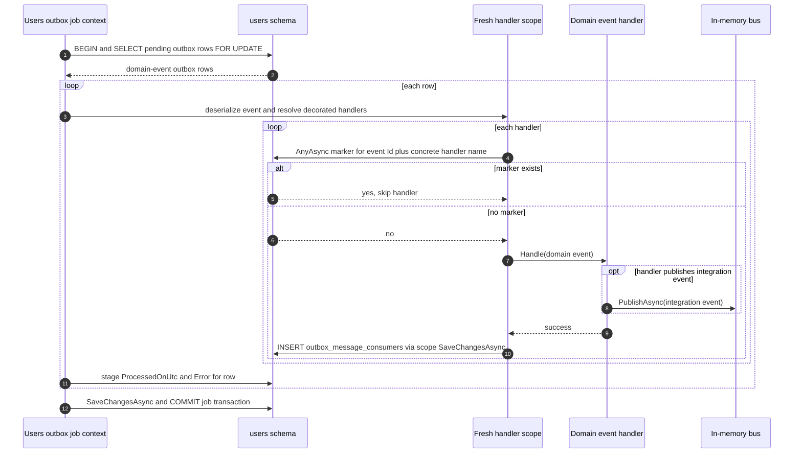
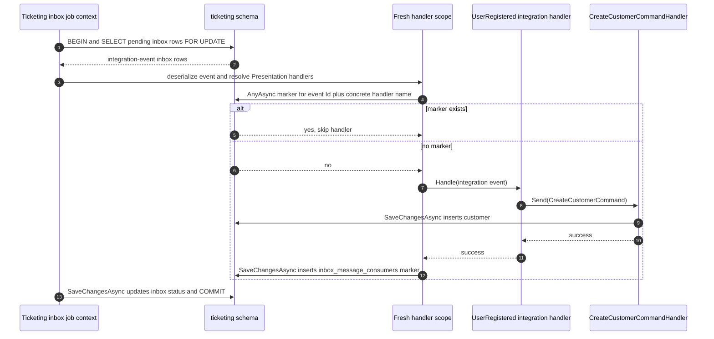

# Database reads, writes, errors, and retries

[Overview](README.md) · [Domain outbox](01-domain-events-and-outbox.md) · [Integration inbox](02-integration-events-and-inbox.md) · [Operations](03-operations-and-failure-modes.md)

**Current implementation, not a proposed retry design.** Example below follows `UserRegisteredDomainEvent` from Users to `UserRegisteredIntegrationEvent` in Ticketing; Attendance has a parallel inbox path. Domain handlers may do other work instead of publishing.

## Who owns each database operation?

| Owner | Database activity | Transaction boundary |
| --- | --- | --- |
| Registration command's `UsersDbContext` | Saves `users.users` and `users.outbox_messages` in one `SaveChangesAsync`. | Originating save. No Quartz job exists yet. |
| Users `ProcessOutboxJob`'s `UsersDbContext` | Starts transaction; locks/reads pending outbox rows; finally saves `ProcessedOnUtc` and `Error`, then commits. | **Job transaction**, held across its batch. |
| Fresh per-message DI scope's `UsersDbContext` | Decorator reads `users.outbox_message_consumers`; after handler succeeds, inserts marker and calls `SaveChangesAsync`. Handler may make additional database reads/writes. | **Not automatically enlisted** in outbox job's transaction. |
| Ticketing MassTransit receive consumer's `TicketingDbContext` | Inserts `ticketing.inbox_messages`, calls `SaveChangesAsync`. | Separate receive-time save; no Ticketing business handler yet. |
| Ticketing `ProcessInboxJob`'s `TicketingDbContext` | Starts transaction; locks/reads pending inbox rows; finally saves `ProcessedOnUtc` and `Error`, then commits. | **Job transaction**, held across its batch. |
| Fresh per-message DI scope's `TicketingDbContext` | Decorator reads `ticketing.inbox_message_consumers`; handler's `CreateCustomerCommand` saves customer; decorator then saves marker. | **Not automatically enlisted** in inbox job's transaction. Customer and marker saves are separate calls in this example. |

The job and handler use **different `DbContext` instances** even when both access the same module schema. Each job creates a new async DI scope **per message** to resolve handlers. `FOR UPDATE` locks on a job's context do not make handler writes or in-memory bus publication part of the job's transaction. Sources: [Users outbox job](../../src/Modules/Users/Evently.Modules.Users.Infrastructure/Outbox/ProcessOutboxJob.cs), [Attendance inbox job](../../src/Modules/Attendance/Evently.Modules.Attendance.Infrastructure/Inbox/ProcessInboxJob.cs), [Users outbox decorator](../../src/Modules/Users/Evently.Modules.Users.Infrastructure/Outbox/IdempotentDomainEventHandler.cs), [Attendance inbox decorator](../../src/Modules/Attendance/Evently.Modules.Attendance.Infrastructure/Inbox/IdempotentIntegrationEventHandler.cs).

## 1. Creating an outbox row: same save as entity

1. [`User.Create`](../../src/Modules/Users/Evently.Modules.Users.Domain/Users/User.cs) raises domain event **in memory**. No event SQL yet.
2. [`RegisterUserCommandHandler`](../../src/Modules/Users/Evently.Modules.Users.Application/Users/Commands/RegisterUser/RegisterUserCommandHandler.cs) inserts user into context and calls `IUnitOfWork.SaveChangesAsync`.
3. [`InsertOutboxMessagesInterceptor.SavingChangesAsync`](../../src/Shared/Evently.Shared.Infrastructure/Outbox/InsertOutboxMessagesInterceptor.cs) reads tracked entities' pending events **in memory**, clears their event lists, and tracks an `OutboxMessage` with the domain event's `Id`, type name, serialized content, and occurrence timestamp. `AddRange` does **not** issue its own SQL INSERT.
4. EF's `SaveChangesAsync` persists entity changes and outbox row together. If save fails, neither write is guaranteed committed. Events were already cleared from the entities' in-memory event lists; the tracked outbox entity may still be present in that context, so retrying a failed context requires care.

## 2. Dispatching an outbox row: read, handle, mark

The job's query is `WHERE processed_on_utc IS NULL ORDER BY occurred_on_utc LIMIT BatchSize FOR UPDATE`. It deserializes each row and resolves handlers from originating module's **Application** assembly. For each handler, decorator's `AnyAsync` checks `(OutboxMessageId = domainEvent.Id, Name = decorated.GetType().Name)`; only if absent does it invoke handler. If handler returns normally, decorator `Add`s marker **then calls `SaveChangesAsync`**; that call sends the marker INSERT to database. Example [UserRegistered handler](../../src/Modules/Users/Evently.Modules.Users.Application/Users/DomainEventHandlers/UserRegisteredDomainEventHandler.cs) queries user and publishes via [`EventBus`](../../src/Shared/Evently.Shared.Infrastructure/EventBus/EventBus.cs). Publication is **not** an INSERT into another outbox table.

`ProcessedOnUtc` / `Error` updates occur **after** handler loop, through job context's **one final `SaveChangesAsync` and commit for the batch**. Changing properties in memory earlier does not make status durable yet. If multiple handlers run, each successful handler writes its own marker. Marker saves by handler scopes can commit **before** job's final status commit. Sources: [Users outbox job](../../src/Modules/Users/Evently.Modules.Users.Infrastructure/Outbox/ProcessOutboxJob.cs) and [decorator](../../src/Modules/Users/Evently.Modules.Users.Infrastructure/Outbox/IdempotentDomainEventHandler.cs).

## 3. Receiving integration event: inbox row, not handler marker

MassTransit delivers event to each registered module's [`IntegrationEventConsumer<T>`](../../src/Modules/Ticketing/Evently.Modules.Ticketing.Infrastructure/Inbox/IntegrationEventConsumer.cs). Ticketing consumer tracks an `InboxMessage` using incoming integration event `Id`, then `SaveChangesAsync` inserts `ticketing.inbox_messages`. Attendance independently inserts its own `attendance.inbox_messages` row with same ID. **No `inbox_message_consumers` row is written during receive**, and no Presentation business handler runs then.

If inbox insert fails, consumer's `Consume` throws (no catch in that class); row was not successfully saved by this call. The provided code does not configure an explicit application-level retry of this receive operation. A duplicate delivery using an already-stored ID can fail on inbox primary key **before** per-handler deduplication is consulted. Do not confuse MassTransit receive consumer with database *consumer marker*.

## 4. Dispatching an inbox row: business save then marker save

The inbox job's pending query is analogous to outbox query. Handler types come from module **Presentation** assembly. Decorator checks `(InboxMessageId = integrationEvent.Id, Name = decorated.GetType().Name)` with `AnyAsync`. On absent marker, [Ticketing Presentation handler](../../src/Modules/Ticketing/Evently.Modules.Ticketing.Presentation/Customers/UserRegisteredIntegrationEventHandler.cs) calls [`CreateCustomerCommandHandler`](../../src/Modules/Ticketing/Evently.Modules.Ticketing.Application/Customers/Commands/CreateCustomer/CreateCustomerCommandHandler.cs), which saves customer **before** decorated handler returns; only after return does decorator insert and save its marker. If a handler instead leaves changes tracked without saving them, decorator's `SaveChangesAsync` can flush those changes alongside its marker in the **same scoped context**. Neither path automatically shares inbox job transaction.

## Failure outcomes: which rows remain?

Outcomes below assume job's final status save/commit succeeds where stated. A failed job-level final save/commit has different outcome; see last row.

| Failure point | Handler marker | Message row | Automatic application retry? |
| --- | --- | --- | --- |
| Origin `SaveChangesAsync` fails | No dispatch marker. | Entity and outbox not successfully persisted by that save; pending entity events already cleared in memory. | Not by these jobs: no committed outbox row to poll. |
| Outbox/inbox **pending-row query** fails before per-row `try` | Unchanged. | Existing row stays pending if job transaction rolls back. | Next scheduled job can select it if still pending. |
| Decorator's **marker `AnyAsync`** fails | No new marker. | Per-row catch logs error, then status saves `ProcessedOnUtc != null`, `Error != null`. | **No** normal poll retry. |
| Handler throws **before any durable side effect** | No marker for failing handler. Earlier successful handlers may already have markers. | Same processed-with-error status. Later handlers of this message do not run. | **No** normal poll retry. |
| Handler **publishes or saves business data**, then throws or marker save fails | Marker for failing handler absent (unless its save actually committed). Side effect may already exist. | Job normally stores processed-with-error status. | **No** normal poll retry. Manual replay risks repeating side effect. |
| Receive consumer's **inbox `SaveChangesAsync`** fails | No inbox handler marker (job has not run). | New inbox row not successfully persisted by that call; origin outbox state is separate. | No explicit application retry configured here; transport behavior is separate. |
| Duplicate inbox insert with existing event ID | Existing markers unchanged. | Existing inbox row remains; new INSERT may hit primary-key violation. | Marker check does **not** run at ingestion. |
| **Inbox business save succeeds**, marker save then fails | No new inbox handler marker (unless marker save committed). Business row may already be committed. | Job normally stores processed-with-error status. | **No** normal poll retry; replay can duplicate business effect. |
| Job's **final status save or commit** fails outside per-row `try` | Successful handler markers may already have committed in separate contexts. | Status update may roll back; message may remain pending (commit outcome can be ambiguous). | Next scheduled poll may select pending row; decorators skip already marked handlers. |

For **either** job, a caught per-row exception still leads to `ProcessedOnUtc = UtcNow` plus `Error = exception.ToString()`; normal poll filters `processed_on_utc IS NULL`. `ProcessedOnUtc` therefore means **attempt finalized by job**, not **all handlers succeeded**. Status of successful row has `Error = null`; if deserialization or handler resolution fails, no handler marker is written. Jobs log exceptions and continue to next row. Sources: [outbox job](../../src/Modules/Users/Evently.Modules.Users.Infrastructure/Outbox/ProcessOutboxJob.cs), [inbox job](../../src/Modules/Attendance/Evently.Modules.Attendance.Infrastructure/Inbox/ProcessInboxJob.cs).

**Retries in current code:** no attempt count, next-attempt time, dead-letter table, or automatic handler retry for processed-with-error rows. Manually making a message pending again would cause another dispatch attempt; already persisted per-handler markers cause those handlers to be skipped, while unmarked handlers could execute again. That is **not** an exactly-once guarantee: external effects and marker saves are not atomic. Inspect `Error`, marker rows, and business side effects **before** any manual replay. This page does not add retry logic or a `CompletedOnUtc` column; both would require code/migration changes.
