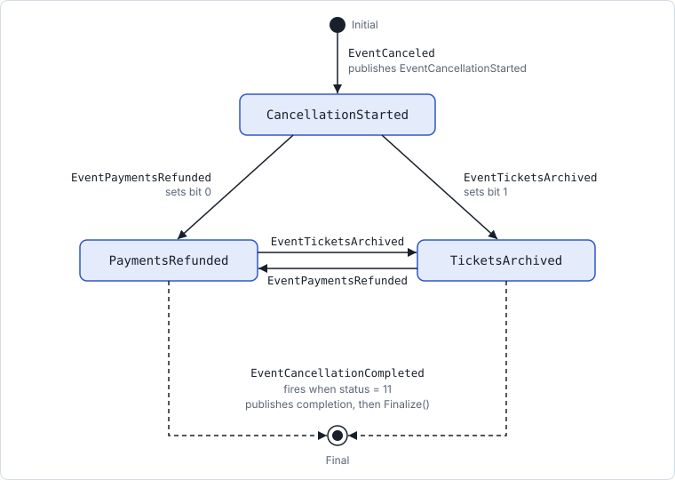
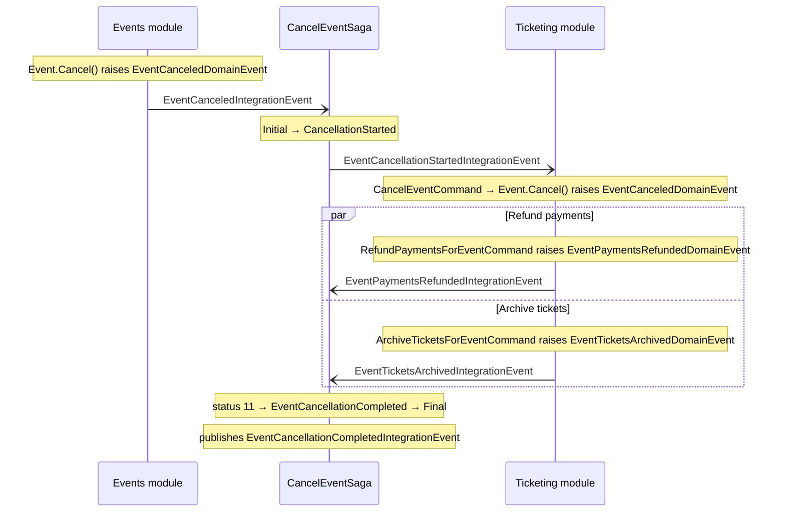

# Cancel event saga

[Overview](README.md) · [Integration inbox](02-integration-events-and-inbox.md)

`CancelEventSaga` coordinates canceling an event across modules. It lives in the Events module; Ticketing refunds payments and archives tickets in parallel, and the saga waits for both before it publishes that the cancellation is complete.

| Aspect | Value |
| --- | --- |
| State machine | `CancelEventSaga : MassTransitStateMachine<CancelEventState>` |
| Instance data | `CorrelationId`, `CurrentState`, `CancellationCompletedStatus`, `Version` (`ISagaVersion`, used by the Redis repository for optimistic concurrency) |
| Correlation | Every message's `EventId` maps to the saga's `CorrelationId`: one saga instance per canceled event |
| Persistence | Redis, via `RedisRepository` in [`EventsModule.cs`](../../src/Modules/Events/Evently.Modules.Events.Infrastructure/EventsModule.cs) |

Source: [`CancelEventSaga.cs`](../../src/Modules/Events/Evently.Modules.Events.Presentation/Events/CancelEventSaga/CancelEventSaga.cs), [`CancelEventState.cs`](../../src/Modules/Events/Evently.Modules.Events.Presentation/Events/CancelEventSaga/CancelEventState.cs).

## State machine

Read top to bottom. Arrows are labeled with the event that triggers them. Initial and Final are MassTransit's built-in states.

Solid arrows are integration events received from the bus. Dashed arrows are `EventCancellationCompleted`, the composite event MassTransit raises itself.

The saga only rests in `PaymentsRefunded` or `TicketsArchived` after the first step. When the second step arrives, the saga moves across to that step's state, the composite event fires, and `DuringAny` finalizes it, all while handling that one message.

## Transitions

Each row matches one `When(...)` in the `CancelEventSaga` constructor.

| In state | When | Then | Goes to |
| --- | --- | --- | --- |
| Initial | `EventCanceled` | Creates the saga instance and publishes `EventCancellationStartedIntegrationEvent` | `CancellationStarted` |
| `CancellationStarted` | `EventPaymentsRefunded` | Sets bit 0 | `PaymentsRefunded` |
| `CancellationStarted` | `EventTicketsArchived` | Sets bit 1 | `TicketsArchived` |
| `PaymentsRefunded` | `EventTicketsArchived` | Sets bit 1. Status becomes 3, so the composite event fires | `TicketsArchived`, then Final |
| `TicketsArchived` | `EventPaymentsRefunded` | Sets bit 0. Status becomes 3, so the composite event fires | `PaymentsRefunded`, then Final |
| Any except Initial and Final | `EventCancellationCompleted` | Publishes `EventCancellationCompletedIntegrationEvent` and calls `Finalize()` | Final |

## `CancellationCompletedStatus`

An `int` bitmask saved on `CancelEventState`. Each event passed to `CompositeEvent` owns one bit, in the order they are passed. The composite event fires when every bit is set.

| Value | Bits | Meaning | Saga rests in |
| --- | --- | --- | --- |
| 0 | `00` | No step reported yet | `CancellationStarted` |
| 1 | `01` | Payments refunded | `PaymentsRefunded` |
| 2 | `10` | Tickets archived | `TicketsArchived` |
| 3 | `11` | Both steps done | Nothing: `EventCancellationCompleted` fires and the saga goes to Final |

## Messages between modules

The saga lives in the Events module but only talks to Ticketing through integration events on the bus.

Domain events go through each module's outbox before their handlers publish the integration event. The saga itself is stored in Redis.
