# Domain events, outbox, integration events, and inbox

Evently has four modules: **Events**, **Users**, **Ticketing**, and **Attendance**. Each has its own PostgreSQL schema and EF Core `DbContext`. Domain events stay in their originating module; integration events cross module boundaries via MassTransit. **The outbox contains domain events, not integration-event envelopes.** A domain-event handler publishes an integration event when the outbox job runs. The transport is currently **MassTransit in-memory**, not a durable external broker.

| Read | Covers |
| --- | --- |
| [01 – Domain events and outbox](01-domain-events-and-outbox.md) | Entity to outbox row to domain handlers; class and sequence diagrams |
| [02 – Integration events and inbox](02-integration-events-and-inbox.md) | Publish, receive, persist, dispatch; cross-module sequence and component diagrams |
| [03 – Operations and failure modes](03-operations-and-failure-modes.md) | Table layout, jobs, transaction boundaries, idempotency, failure behavior |
| [04 – Database reads, writes, and retries](04-database-reads-writes-and-retries.md) | Exact order of SQL reads/writes, scopes, commits, and outcomes at each failure point |

## System map

```mermaid
flowchart LR
    subgraph Origin[Originating module - Users or Events or Ticketing or Attendance]
        E[Entity raises domain event] --> S[EF Core SaveChangesAsync + interceptor]
        S --> DB1[(Module schema: entity + outbox_messages)]
        DB1 --> O[Quartz ProcessOutboxJob]
        O --> DH[Domain event handler + idempotency decorator]
    end
    DH -->|optional: publish integration event| BUS[MassTransit in-memory bus]
    subgraph Destination[Subscribing module - Ticketing or Attendance]
        C[MassTransit IntegrationEventConsumer] --> DB2[(Module schema: inbox_messages)]
        DB2 --> I[Quartz ProcessInboxJob]
        I --> IH[Integration event handler + idempotency decorator]
        IH --> DM[(Module business tables)]
    end
    BUS --> C
```

Each module also has its own inbox and outbox tables/jobs, but **only Ticketing and Attendance register MassTransit receive consumers in `Program.cs`**. Users and Events do not currently register incoming consumers. All four configure inbox handler discovery; a job alone is not a bus subscription. See [`Program.cs`](../../src/API/Evently.Api/Program.cs), [`InfrastructureConfiguration.cs`](../../src/Shared/Evently.Shared.Infrastructure/InfrastructureConfiguration.cs), [`TicketingModule.cs`](../../src/Modules/Ticketing/Evently.Modules.Ticketing.Infrastructure/TicketingModule.cs), and [`AttendanceModule.cs`](../../src/Modules/Attendance/Evently.Modules.Attendance.Infrastructure/AttendanceModule.cs).

## Concrete route: user registered

1. `RegisterUserCommandHandler` inserts a `User`; `User.Create` raises `UserRegisteredDomainEvent`.
2. `SaveChangesAsync` calls `InsertOutboxMessagesInterceptor`, persisting user and domain-event outbox row together in **Users** schema.
3. Users outbox job resolves `UserRegisteredDomainEventHandler`, which loads user data and publishes `UserRegisteredIntegrationEvent`, preserving domain event `Id` and `OccurredOnUtc`.
4. MassTransit sends that event to **Ticketing** and **Attendance** consumers. Each writes its own inbox row; no business handler executes in the bus consumer.
5. Each destination's inbox job invokes its presentation-layer handler: `CreateCustomerCommand` in Ticketing; `CreateAttendeeCommand` in Attendance.

Source: [`RegisterUserCommandHandler`](../../src/Modules/Users/Evently.Modules.Users.Application/Users/Commands/RegisterUser/RegisterUserCommandHandler.cs), [`User`](../../src/Modules/Users/Evently.Modules.Users.Domain/Users/User.cs), [`UserRegisteredDomainEventHandler`](../../src/Modules/Users/Evently.Modules.Users.Application/Users/DomainEventHandlers/UserRegisteredDomainEventHandler.cs), [Ticketing handler](../../src/Modules/Ticketing/Evently.Modules.Ticketing.Presentation/Customers/UserRegisteredIntegrationEventHandler.cs), [Attendance handler](../../src/Modules/Attendance/Evently.Modules.Attendance.Presentation/Attendees/IntegrationEventHandlers/UserRegisteredIntegrationEventConsumer.cs).

## Vocabulary

| Term | Meaning here |
| --- | --- |
| Domain event | `IDomainEvent` raised by an `Entity`; stored in **origin module** `outbox_messages`, dispatched to its Application handlers. |
| Integration event | `IIntegrationEvent` published by an Application domain-event handler via `IEventBus` / MassTransit; carries data across modules. |
| Outbox | Durable **domain-event** row saved with an entity; Quartz later runs domain-event handlers. Not a durable integration-event publication queue. |
| Inbox | Durable copy of a received integration event in the **destination module**; Quartz later runs Presentation handlers. |
| Consumer marker | `(message ID, concrete handler class name)` row in `*_message_consumers`, written after a handler returns successfully. Distinct from MassTransit receive consumer. |

**Guarantee boundary:** database-persisted domain outbox and destination inbox are separate from in-memory bus publication. Do not assume end-to-end exactly-once delivery or durable integration-event publication; see [failure modes](03-operations-and-failure-modes.md) and [step-by-step DB timeline](04-database-reads-writes-and-retries.md).
