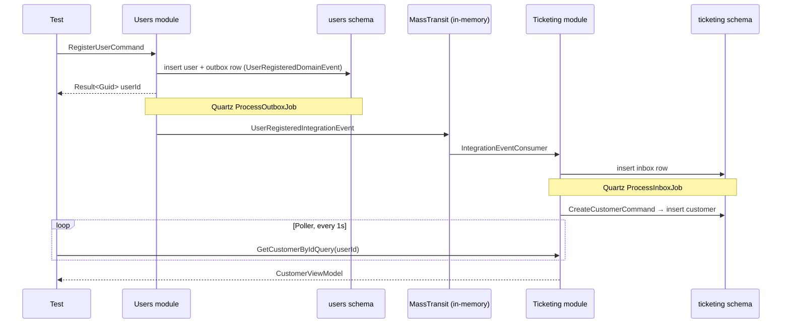

# Evently.Tests.IntegrationTests

Cross-module integration tests. The per-module projects under `test/Modules/<Module>/` check one module in isolation; this project checks that the modules **work together**.

A typical scenario sends a command to one module and asserts on the state of *another* module:

> command in module A → domain event → integration event → module B receives it → the result is visible in module B's schema

The reference case is user registration: `RegisterUserCommand` runs in **Users**, and the same person must then exist as a `Customer` in **Ticketing** and as an `Attendee` in **Attendance**.

## The flow being tested

Nothing in this chain is mocked. The tests exercise the real outbox, the real MassTransit (in-memory) bus, and the real inbox, each backed by its own PostgreSQL schema.



**Attendance** subscribes to the same integration event and runs `CreateAttendeeCommand` in the same way. The mechanics of outbox, bus and inbox are documented in [`docs/events`](../../docs/events/README.md).

## Scenarios

| Test | Action | Cross-module assertion |
| --- | --- | --- |
| `RegisterUserTests.RegisterUser_Should_PropagateToTicketingModule` | `RegisterUserCommand` (Users) | `GetCustomerByIdQuery` (Ticketing) returns a customer with the user's id |
| `RegisterUserTests.RegisterUser_Should_PropagateToAttendanceModule` | `RegisterUserCommand` (Users) | `GetAttendeeQuery` (Attendance) returns an attendee with the user's id |
| `AddItemToCartTests.Customer_ShouldBeAbleTo_AddItemToCart` | `RegisterUserCommand` (Users), then `AddItemToCartCommand` (Ticketing) | The customer propagated from Users can be used by a Ticketing command |

In `AddItemToCartTests` only the Users → Ticketing hop is cross-module. The event and its ticket type are created directly in Ticketing through `CommandHelpers.CreateEventAsync` (Ticketing's own `CreateEventCommand`), not by publishing an event from the Events module.

## How the tests are built

### Real host, real infrastructure

[`IntegrationTestWebAppFactory`](Abstractions/IntegrationTestWebAppFactory.cs) boots the actual API (`WebApplicationFactory<Program>`) against containers started with Testcontainers:

| Container | Image | Used for |
| --- | --- | --- |
| PostgreSQL | `postgres:18` | All module schemas, outbox and inbox tables |
| Redis | `redis:8` | Cache, cart storage |
| Keycloak | `quay.io/keycloak/keycloak:26.7` | Identity provider called by `RegisterUserCommand`; the `Evently` realm is imported from [`realm-export.json`](realm-export.json) |

The host runs in the `Development` environment, so EF Core migrations are applied at startup.

Connection strings and JWT settings are injected through environment variables. The Keycloak admin and token URLs are overridden with `ConfigureTestServices` instead, because `modules.*.json` files are added to the configuration *after* environment variables and would win over them.

### One host for the whole run

[`IntegrationTestCollection`](Abstractions/IntegrationTestCollection.cs) registers the factory as an xUnit collection fixture, so the containers and the host start once and are shared by every test class.

The database is **not** reset between tests. Each test generates its own data with Bogus (random email, names, ids), so tests do not depend on each other's rows.

### Commands and queries, not HTTP

[`BaseIntegrationTest`](Abstractions/BaseIntegrationTest.cs) opens a DI scope on the running host and exposes `ISender`. Tests send the same MediatR commands and queries the endpoints would send, skipping the HTTP layer and authentication. Each module is used only through its public Application contracts.

### Waiting for eventual consistency

Propagation between modules is asynchronous: the outbox job and the inbox job each run on a Quartz interval (15 seconds in the configuration the host loads). Asserting right after the command returns would fail.

[`Poller.WaitAsync`](Abstractions/Poller.cs) re-runs a query once per second until it returns a successful `Result` or the timeout expires, in which case it returns a `Poller.Timeout` failure. The timeout has to cover one outbox interval plus one inbox interval, so about 30 seconds in the worst case:

```csharp
Result<CustomerViewModel> customerResult = await Poller.WaitAsync(
    TimeSpan.FromSeconds(35),
    async () => await Sender.Send(new GetCustomerByIdQuery(userResult.Value)));

customerResult.IsSuccess.Should().BeTrue();
```

## Adding a scenario

1. Create a folder named after the scenario and a test class deriving from `BaseIntegrationTest`.
2. Send the command to the originating module through `Sender` and assert that it succeeded.
3. Poll a query of the **destination** module with `Poller.WaitAsync` until the propagated data appears.
4. Assert on the destination module's result.

Shared arrange steps go in [`CommandHelpers`](Abstractions/CommandHelpers.cs) as `ISender` extension methods.

## Running

Docker must be running, since the containers are started by the tests.

```bash
dotnet test test/Evently.Tests.IntegrationTests
```
